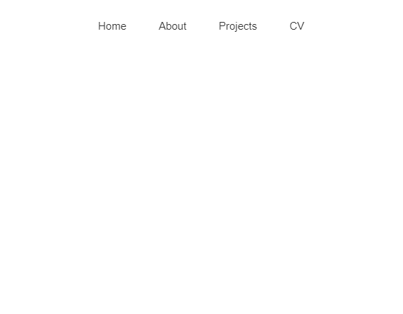

A great user experience requires that a website responds to the size of the screen it is being viewed on. To achieve this, we can write media queries.

With media queries, a website’s content adapts to different screen sizes. CSS detects the size of the current screen and applies different CSS styles depending on the width of the screen.

The code example below demonstrates how a media query is applied:

```css {numberLines}
@media (max-width: 576px) {
  .hamburger {
    display: block;
  }
}
```

Let’s break this example down into its parts:

- ~~@media~~ — This keyword begins a media query rule and instructs the CSS compiler on how to parse the rest of the rule.
- ~~(max-width : 576px)~~ — This part of the rule is called a media feature, and instructs the CSS compiler to apply the CSS styles to devices with a width of 576 pixels or smaller. Media features are the conditions that must be met in order to render the CSS within a media query.
- CSS rules are nested inside of the media query’s curly braces. The rules will be applied when the media query is met.

In the example above, the hamburger menu becomes visible when the width of the user’s screen size is 576px or smaller.

In the following example, we have written media queries to show the user either a navigation bar or a hamburger menu depending on the width of the user’s screen.

- For screen widths greater than 576px, we display _only_ the navigation bar. The hamburger menu remains hidden.
- Conversely, for screen widths of 576px or smaller, we display _only_ the hamburger menu. The navigation bar remains hidden.

```jsx:title=src/components/Hamburger.js {numberLines}
import React from "react";

const Hamburger = () => {
  return (
    <div className="hamburger">
      <div className="hamburger-line-container">
        <div className="hamburger-line hamburger-line-one"></div>
        <div className="hamburger-line hamburger-line-two"></div>
      </div>
    </div>
  );
};

export default Hamburger;
```

```jsx:title=src/components/Header.js {numberLines}
import React from "react";
import Hamburger from "./Hamburger";

const Header = () => {
  return (
    <nav>
      <Hamburger />
      <ul className="navbar-list">
        <li className="navbar-list-item">Home</li>
        <li className="navbar-list-item">About</li>
        <li className="navbar-list-item">Projects</li>
        <li className="navbar-list-item">CV</li>
      </ul>
    </nav>
  );
};

export default Header;
```

```css:title=src/App.js {numberLines}
import React from "react";
import Header from "./components/Header";

const App = () => {
  return (
    <>
      <Header />
    </>
  );
};

export default App;
```

```css:title=src/index.css {numberLines}
* {
  padding: 0;
  margin: 0;
  box-sizing: border-box;
}

html {
  font-size: 10px;
  font-family: sans-serif;
}

/********************/
/****** HEADER ******/
/********************/

nav {
  width: 100%;
  height: 4.5rem;
  position: fixed;
  top: 3rem;
  left: 0;
}

.navbar-list {
  width: 35%;
  height: 100%;
  display: flex;
  justify-content: space-between;
  align-items: center;
  list-style: none;
  margin: 0 auto;
}

.navbar-list-item {
  color: #333;
  font-size: 1.5rem;
}

.hamburger {
  width: 4.5rem;
  height: 4.5rem;
  position: fixed;
  top: 3rem;
  right: 1rem;
  z-index: 400;
  display: none;
}

.hamburger-line-container {
  width: 2.5rem;
  height: 2.5rem;
  cursor: pointer;
  position: absolute;
  top: 50%;
  left: 50%;
  transform: translate(-50%, -50%);
}

.hamburger-line-one {
  width: 100%;
  height: 0.2rem;
  background-color: #333;
  border: 0.1rem solid #333;
  position: absolute;
  top: 30%;
}
.hamburger-line-two {
  width: 100%;
  height: 0.2rem;
  background-color: #333;
  border: 0.1rem solid #333;
  position: absolute;
  top: 70%;
}

/***************************/
/****** END OF HEADER ******/
/***************************/
@media (max-width: 992px) {
  .navbar-list {
    width: 45%;
  }
}

@media (max-width: 768px) {
  .navbar-list {
    width: 50%;
  }
}

@media (max-width: 576px) {
  .hamburger {
    display: block;
  }

  .navbar-list {
    display: none;
  }
}
```

**screen size > 576px**



**screen size <= 576px**


