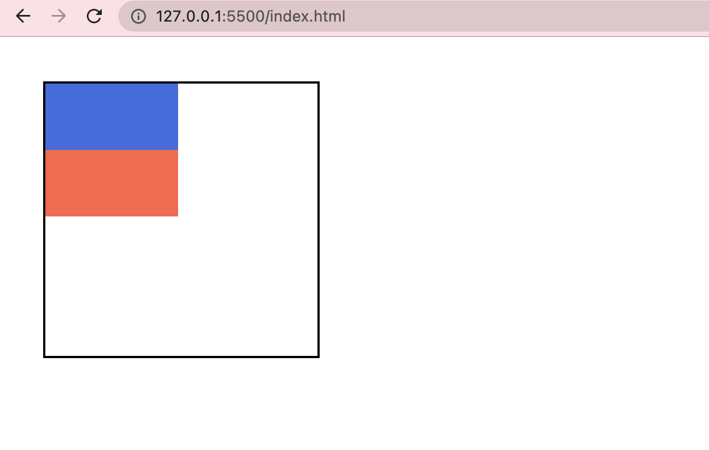
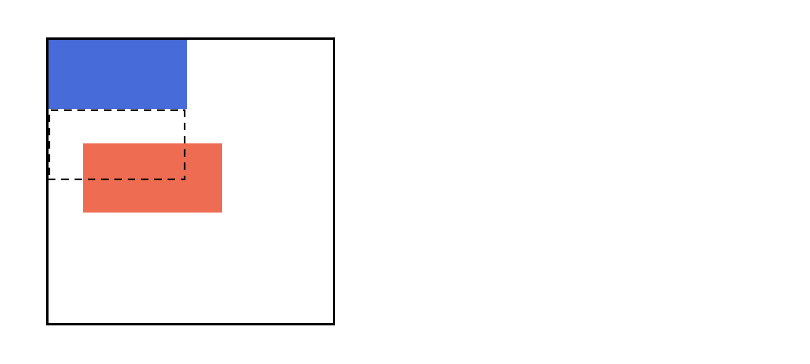
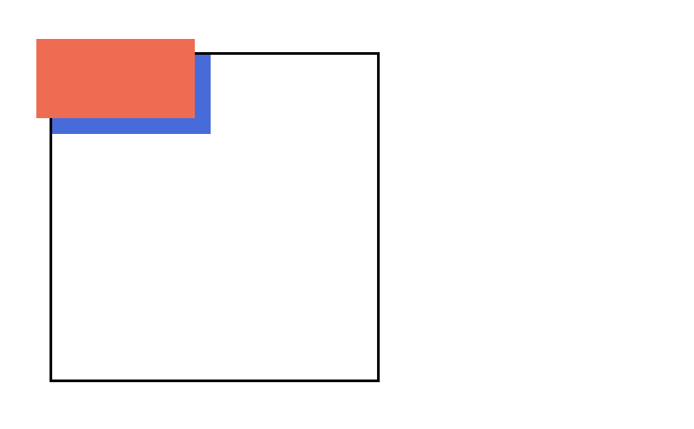
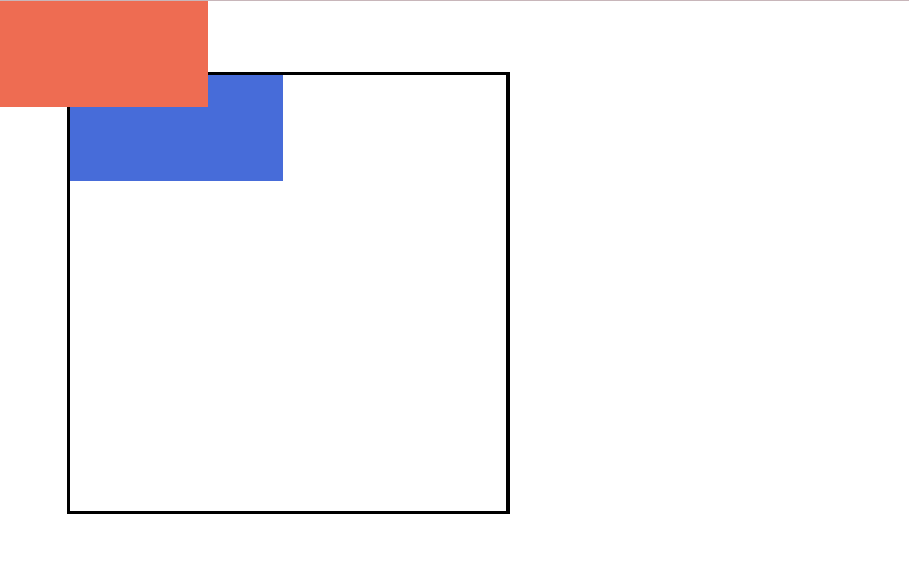

```toc

```

A browser renders the elements of an HTML document that has no CSS, from left to right, top to bottom, in the same order as they exist in the document. This is called the _flow_ of elements in HTML.

CSS includes properties we can use to change how a browser positions elements. In this post, we will learn how to use the _position_ property to adjust the position of HTML elements.

The _position_ property can take one of the following values:

- **static** (the default value, no need to specify)
- **relative**
- **absolute**
- **fixed**

We will use the following code samples to create two block-level elements on the page.

```html:title=index.html {numberLines}
<!DOCTYPE html>
<html lang="en">
  <head>
    <meta charset="UTF-8" />
    <meta name="viewport" content="width=device-width, initial-scale=1.0" />
    <meta http-equiv="X-UA-Compatible" content="ie=edge" />
    <link
      rel="stylesheet"
      href="https://use.fontawesome.com/releases/v5.3.1/css/all.css"
      integrity="sha384-mzrmE5qonljUremFsqc01SB46JvROS7bZs3IO2EmfFsd15uHvIt+Y8vEf7N7fWAU"
      crossorigin="anonymous"
    />
    <link
      href="https://fonts.googleapis.com/css?family=Oswald:200,300,400,500|Roboto+Condensed:300,300i,400,400i,700,700i"
      rel="stylesheet"
    />
    <link rel="stylesheet" href="./style.css" />
    <title>CSS POSITION PROPERTY</title>
  </head>
  <body>
    <div class="box-container">
      <div class="box box-one"></div>
      <div class="box box-two"></div>
    </div>

    <script src="./app.js"></script>
  </body>
</html>
```

```css:title=style.css {numberLines}
* {
  margin: 0;
  padding: 0;
  box-sizing: border-box;
}

html {
  font-size: 62.5%;
  font-family: sans-serif;
}

.box-container {
  width: 25rem;
  height: 25rem;
  margin: 4rem;
  border: 0.2rem solid black;
}

.box {
  width: 12rem;
  height: 6rem;
}

.box-one {
  background-color: royalblue;
}

.box-two {
  background-color: tomato;
}
```

The result is as follows:



In the image above, we can see that block-level elements consistently appear on the left side of the browser. This is the default _position_ for block-level elements.

### Position:Relative

One way to modify the default position of an element is by setting its position property to relative. This value allows you to position an element relative to its default static position on the web page.

```css {numberLines, 3-5}
.box-two {
  background-color: tomato;
  position: relative;
  top: 3rem;
  left: 3rem;
}
```

The code example above instructs the browser to expect a relative positioning of the \<div> and specifies where the \<div> should be positioned on the page.

In the example above, the \<div> has been positioned using two of the four _offset properties_. The valid offset properties are:

- **top**: moves the element down
- **bottom**: moves the element up
- **left**: moves the element right
- **right**: moves the element left

in the example above, the \<div> will be moved down 3rem and 3rem to the right from its default static position.



The image below displays the new position of the box. The dotted line represents where the statically (default) positioned box was positioned.

### Position : Absolute

Another way of modifying the position of an element is by setting its position to _absolute_.

When an element’s position is set to _absolute_ all other elements on the page will ignore the element and act like it is not present on the page. The element will be positioned relative to its closest positioned parent element.

```css {numberLines, 3-5}
.box-two {
  background-color: tomato;
  position: absolute;
  top: 3rem;
  left: 3rem;
}
```

In the example above, the ~~.box-two~~ \<div> will be moved down and right from the top left corner of the view as shown in the following omage:



### Position : Fixed

When an element’s position is set to _absolute_, the element will scroll with the rest of the document when a user scrolls.

We can fix an element to a specific position on the page (regardless of user scrolling) by setting its position to _fixed_.

```css {numberLines, 3-5}
.box-two {
  background-color: tomato;
  position: fixed;
  top: 0rem;
  left: 0rem;
}
```

In the example above, the ~~.box-two~~ \<div> will remain fixed to its position no matter where the user scrolls on the page, like in the image below:



This technique is often used for navigation bars on a web page.
