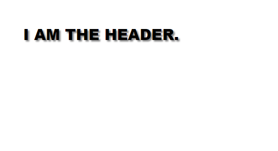
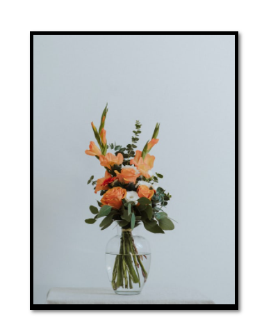

```toc

```

### Text shadow

The ~~text-shadow~~ CSS property adds shadows to text.

```sh {numberLines}
text-shadow: <x-offset> <y-offset> <blur-radius>[optional] <color>[optional]
```

- **x-offset**: Horizontal distance of the shadow from the text
- **y-offset**: Vertical distance of the shadow from the text
- **blur-radius**: The higher the value, the bigger the blur
- **color**: Color of the shadow

```html {numberLines, 11-11}
<!DOCTYPE html>
<html lang="en">
  <head>
    <meta charset="UTF-8" />
    <meta http-equiv="X-UA-Compatible" content="IE=edge" />
    <meta name="viewport" content="width=device-width, initial-scale=1.0" />
    <title>Document</title>
    <link rel="stylesheet" href="style.css" />
  </head>
  <body>
    <h1>I AM THE HEADER.</h1>
  </body>
</html>
```

```css {numberLines, 16-16}
* {
  padding: 0;
  margin: 0;
  box-sizing: border-box;
}

html {
  font-size: 10px;
  font-family: sans-serif;
}

h1 {
  font-size: 3rem;
  font-weight: 900;
  margin: 5rem;
  text-shadow: 0.3rem 0.3rem 0.3rem #888;
}
```



### Box-shadow

The ~~box-shadow~~ CSS property adds shadow effects around an element’s frame.

```sh {numberLines}
text-shadow: <x-offset> <y-offset> <blur-radius> <spread-radius> <color>[optional]
```

- **x-offset**: Horizontal distance of the shadow from the element
- **y-offset**: Vertical distance of the shadow from the element
- **blur-radius**: A higher positive value will cause the shadow to become bigger & lighter
- **spread-radius**: A higher positive value will cause the shadow to expand bigger
- **color**: Color of the shadow

```html {numberLines, 11-13}
<!DOCTYPE html>
<html lang="en">
  <head>
    <meta charset="UTF-8" />
    <meta http-equiv="X-UA-Compatible" content="IE=edge" />
    <meta name="viewport" content="width=device-width, initial-scale=1.0" />
    <title>Document</title>
    <link rel="stylesheet" href="style.css" />
  </head>
  <body>
    <div class="card">
      
    </div>
  </body>
</html>
```

```css {numberLines, 18-18}
* {
  padding: 0;
  margin: 0;
  box-sizing: border-box;
}

html {
  font-size: 10px;
  font-family: sans-serif;
}

.card {
  margin: 5rem;
  width: 30rem;
  height: 40rem;
  background-color: black;
  padding: 0.5rem;
  box-shadow: 0.3rem 0.3rem 0.5rem #777;
}

.card img {
  width: 100%;
}
```


