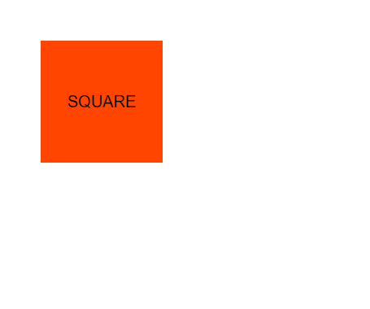
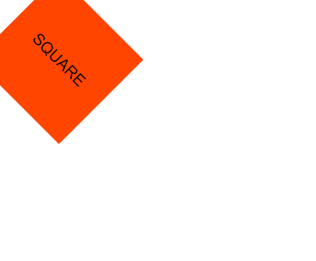
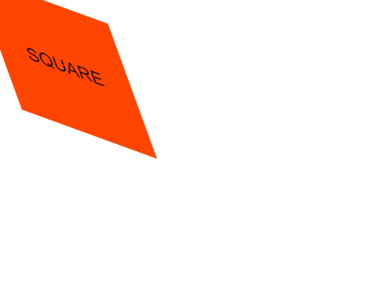
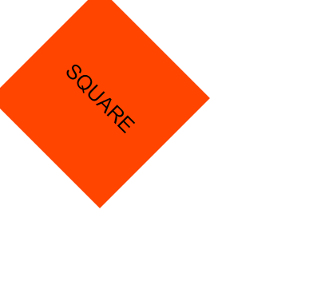

The ~~transform~~ CSS property let’s us rotate, scale, skew or translate an element.

```toc

```

```html:title=index.html {numberLines, 11-11}
<!DOCTYPE html>
<html lang="en">
<head>
    <meta charset="UTF-8">
    <meta http-equiv="X-UA-Compatible" content="IE=edge">
    <meta name="viewport" content="width=device-width, initial-scale=1.0">
    <link rel="stylesheet" href="style.css">
    <title>Document</title>
</head>
<body>
    <div class="box">SQUARE </div>
</body>
</html>
```

```css:title=style.css {numberLines, 12-24}
* {
  padding: 0;
  margin: 0;
  box-sizing: border-box;
}

html {
  font-size: 10px;
  font-family: sans-serif;
}

.box {
  width: 15rem;
  height: 15rem;
  background-color: orangered;
  display: grid;
  place-items: center;
  font-size: 2rem;
  transition: transform, 1s;
}

.box:hover {
  transform: rotate(45deg);
}
```

### translate

```css {numberLines}
.box:hover {
  transform: translate(5rem, 5rem);
}
```



### scale

```css {numberLines}
.box:hover {
  transform: scale(2, 2);
}
```


### rotate

```css {numberLines}
.box:hover {
  transform: rotateZ(45deg);
}
```



### skew

```css {numberLines}
.box:hover {
  transform: skew(20deg, 20deg);
}
```



### Multiple transformations at once

```css {numberLines}
.box:hover {
  transform: translate(5rem, 5rem) rotate(45deg) scale(1.3, 1.3);
}
```



### Syntax

```css {numberLines}
transform: rotate(45deg);
transform: rotateX(20deg);
transform: rotateY(20deg);

transform: translate(5rem, 5rem);
transform: translateX(3rem);
transform: translateY(5rem);

transform: scale(2, 1.5);
transform: scaleX(2);
transform: scaleY(0.5);

transform: skew(30deg, 20deg);
transform: skewX(30deg);
transform: skewY(20deg);
```
