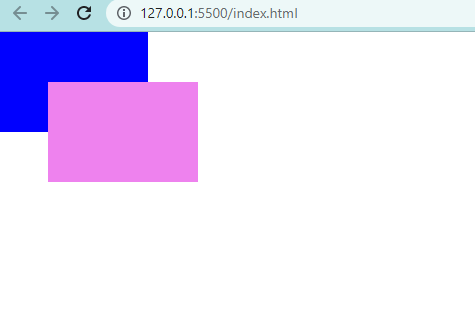

Let’s create two boxes that overlap with each other.

```html {numberLines}
<!DOCTYPE html>
<html lang="en">
   <meta charset="UTF-8">
   <meta name="viewport" content="width=device-width, initial-scale=1.0">
   <title>Document</title>
   <link rel="stylesheet" href="style.css">
</head>
<body>
   <div class="box-one"></div>
   <div class="box-two"></div>
</body>
</html>
```

```css {numberLines}
* {
  padding: 0;
  margin: 0;
  box-sizing: border-box;
}

html {
  font-size: 62.5%;
  font-family: sans-serif;
}

.box-one {
  width: 15rem;
  height: 10rem;
  background-color: blue;
  position: relative;
  top: 0;
  left: 0;
}

.box-two {
  width: 15rem;
  height: 10rem;
  background-color: violet;
  position: absolute;
  top: 5rem;
  left: 5rem;
}
```



The ~~.box-two~~ \<div> is absolutely positioned and overlaps the ~~.box-one~~ \<div>.

The ~~z-index~~ property controls how far back or how far forward an element should appear on the web page when elements overlap. This can be thought of as the depth of elements, with deeper elements appearing behind shallower elements.

The ~~z-index~~ property accepts integer values. Depending on their values, the integers instruct the browser on the order in which elements should be displayed on the web page.

Now, let’s bring the ~~.box-one~~ \<div> to the top.

```css {numberLines, 8-8}
.box-one {
  width: 15rem;
  height: 10rem;
  background-color: blue;
  position: relative;
  top: 0;
  left: 0;
  z-index: 2;
}
```

We have set the ~~z-index~~ to 2. The z-index of 2 moves the ~~.box-one~~ \<div> forward, because it is greater than the ~~.box-two~~ \<div> ~~z-index~~ of 1.

> Note that the ~~.box-one~~ \<div> is relatively positioned. This is because the ~~z-index~~ property doesn’t work on static elements.
