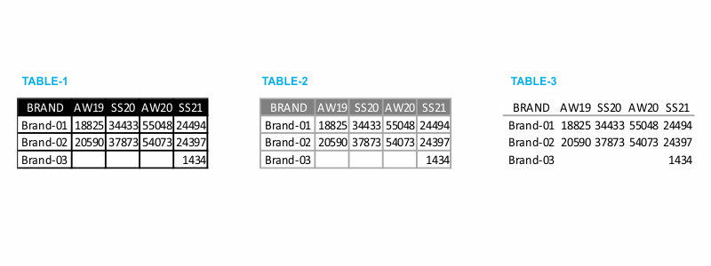
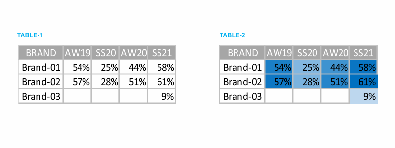

When data is presented in the form of a table, the design must fade into the background, so that data takes the center stage. Don’t let shading or heavy borders compete for attention. I prefer using light borders or simple white space to set apart the elements of the table.

Take a look at the example tables in the following figure. Note how the data stands out more than the structural components of the table in the second and third iterations (light borders and minimal borders).

Borders should be used to improve the legibility of your table. So think about pushing them to the background by making them grey or getting rid of them altogether. The data should be what stands out, not the borders.

### Tables with heatmap

One approach for mixing the detail you can include in a table while also making use of visual cues is via a heatmap. A heatmap is a way to visualize data in tabular format, where in place of (or in addition to) the numbers, you leverage colored cells that convey the relative magnitude of the numbers.

Consider the following figure which shows some generic data in a table and also a heatmap.

In TABLE-1, you are left to read the data. You find yourself scanning across rows and down columns to get a sense of what you are looking at, where numbers are higher or lower.

In TABLE-2, the color saturation provides visual cues, helping our eyes and brains more quickly target the potential points of interest. The higher saturation of blue, the higher the number. This makes the process of picking out the tails of the spectrum — the lowest number (9%) and highest number (61%) — an easier and faster process than it was in TABLE-1 where we didn’t have any visual cues to help direct our attention.

In Excel, we can use the built-in conditional formatting functionality to apply formatting like that shown in TABLE-2.
