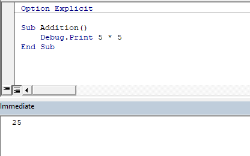

We can use the ~~Print~~ method of the ~~Debug~~ object to display a value in the immediate window.

```vb {numberLines}
Sub Addition()

    Debug.Print 5 * 5

End Sub
```



###### Learn how to run code snippets in the immediate window in my blog post [here](https://hemanta.io/visual-basic-editor-immediate-window/).
