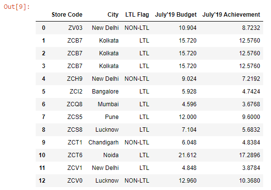
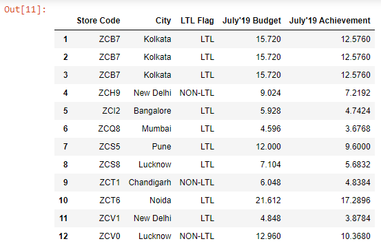
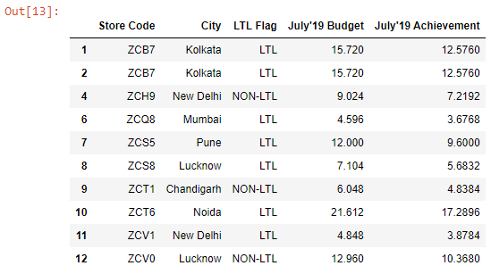
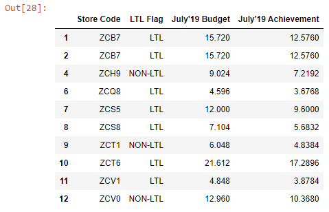
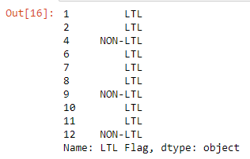
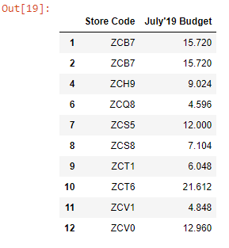

```toc

```

### drop()

Let’s read the ~~budget.xlsx~~ file into a DataFrame:

```py {numberLines}
import pandas as pd

budget = pd.read_excel("budget.xlsx")

budget
```

**Output:**



Note that we have a numeric index in our DataFrame.

Let’s say we want to delete the row with index number ~~0~~. We can use the ~~drop()~~ method, which by default, deletes rows.

```py {numberLines}
budget.drop(labels=0, inplace=True)

budget
```

**Output:**



To delete multiple rows, we have to pass a list to the ~~labels~~ parameter.

Let’s delete rows ~~3~~ & ~~5~~:

```py {numberLines}
budget.drop(labels=[3, 5], inplace=True)

budget
```

**Output:**



What if we want to delete columns?

All we need to do is to pass ~~axis=1~~ to the ~~drop()~~ method.

> axis=1 represents columns. We can also pass ~~axis=”columns”~~.

Let’s delete the ~~City~~ column:

```py {numberLines}
budget.drop(labels="City", axis="columns", inplace=True)

budget
```

**Output:**



Similarly, we can delete more than one column by passing the column labels to a list, like the way we did for rows.

### pop()

For deleting columns, we have access to another method named ~~pop()~~, which removes the column from the DataFrame and also returns it.

```py {numberLines}
budget.pop("LTL Flag")
```

**Output:**



Note that we _can’t_ delete multiple columns with the ~~pop()~~ method.

### del

Another way we can delete a column is by using the ~~del~~ keyword:

```py {numberLines}
del budget["July'19 Achievement"]

budget
```

**Output:**


