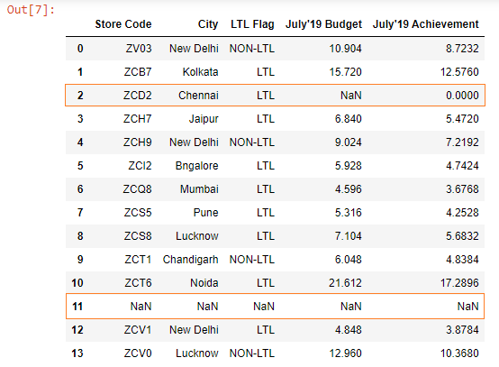
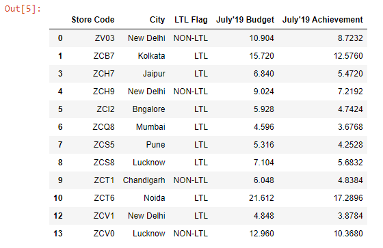
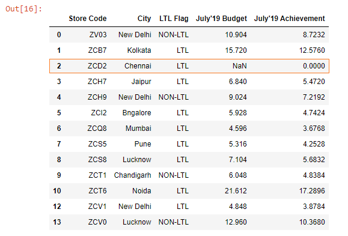

Below, we have read the ~~budget.xlsx~~ file into a DataFrame.

```py {numberLines}
import pandas as pd

budget = pd.read_excel("budget.xlsx")
budget
```

**Output:**



We can see that we have two rows with missing values. The 3rd row (_index no 2_) has one missing value, while the 12th row (_index no 11_) has all missing values.

> Pandas, by default, marks missing values as ~~NaN~~.

### dropna( )

The ~~dropna()~~ method will drop the rows where at least one element is missing.

```py {numberLines}
budget.dropna(inplace = True)
budget
```

We pass ~~inplace = True~~ in order to make the changes to the DataFrame permanent.

**Output:**



As we can see, both the 3rd and the 12th rows have been removed.

What if we want to drop rows only where all elements are missing? In other words, what if we want to remove only the 12th row?

We can do so by passing a value of ~~all~~ to the ~~how~~ parameter in the ~~dropna()~~ method.

> In the ~~dropna()~~ method, the default value of the ~~how~~ parameter is ~~any~~.

```py {numberLines}
budget.dropna(how = "all", inplace = True)
budget
```

**Output:**



As we can see the 12th row where all values were missing has been removed; however, the 3rd row where only one value is missing remains in the DataFrame.
