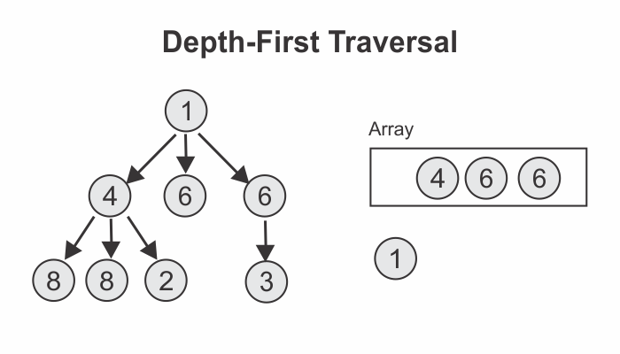

```toc

```

###### Learn to implement a tree data structure using JavaScript in my blog post [here](https://hemanta.io/implementing-a-tree-data-structure-in-javascript/).

###### Learn how to do breadth-first traversal of a tree data structure in my blog post [here](https://hemanta.io/breadth-first-traversal-of-a-tree-data-structure/).

### Direction

Implement a method named ~~traverseDF~~ on the ~~Tree~~ class. The ~~traverseDF~~ method should accept a function that gets called with each node in the tree.

### Algorithm

We will implement the ~~traverseDF~~ method using the following algorithm:

Note that the algorithm is similar to the breadth-first traversal algorithm except for one little difference, which we will discuss below.

**STEP-1**: Create an empty array and push the root node into it.


**STEP-2**: As long as the array has some number of elements inside of it, we will remove the first element from the array, retrieve its children and push them into the array.



**STEP-3**: we pass the node (_removed in the previous step_) to the iterator function (_received as the first argument to the ~~traverseDF~~ method_) and then throw it away.

We then remove the next node from the array, retrieve its children and add them to the start of the array. This is the step where breadth-first and depth-first traversal differ. **In breadth-first traversal, we push the children to the end of the array, whereas in depth-first traversal, we add the children to the beginning of the array**.


**STEP-4**: we pass the node (_removed in the previous step_) to the iterator function (_received as the first argument to the ~~traverseDF~~ method_) and then throw it away.

Next, we remove the first element, which is 8 in our case. 8 does not have any children, so we pass it to the iterator fucntion and then throw it away.


**STEP-5**: We remove the first element from the array.


**STEP-6**: 8 does not have any children, so we pass it to the iterator function and throw it away. Next, we remove the first element from the array.


**STEP-7**: 2 does not have any children, so we pass it to the iterator function and throw it away. Then, we remove the first element from the array.


**STEP-8**: 6 does not have any children, so we pass it to the iterator function and throw it away. Next, we remove the first element from the array.


**STEP-9**: 6 has children, so we add them to the beginning of the array.


**STEP-10**: Then, we pass 6 to the iterator function and throw it away. Thereafter, we remove the first element from the array.


**STEP-11**: 3 does not have any children, so we pass it to the iterator function and throw it away. This marks our end of the depth-first traversal.


### JavaSctipt implementation

```js {numberLines, 21-33}
class Node {
  constructor(data) {
    this.data = data
    this.children = []
  }

  add(data) {
    this.children.push(new Node(data))
  }

  remove(data) {
    this.children = this.children.filter(node => node.data !== data)
  }
}

class Tree {
  constructor() {
    this.root = null
  }

  traverseDF(fn) {
    // create an empty array and push the root node into it
    const arr = [this.root]
    // while there are some elements in the array
    while (arr.length > 0) {
      // remove the first element from the array using the shift() method
      const node = arr.shift()
      // then, add the children of the element (removed from the array in the previous step) at the start of the array
      arr.unshift(...node.children)
      // pass the element removed (node) as an argument to the function passed as an argument to the traverseBF method.
      fn(node)
    }
  }
}
```
