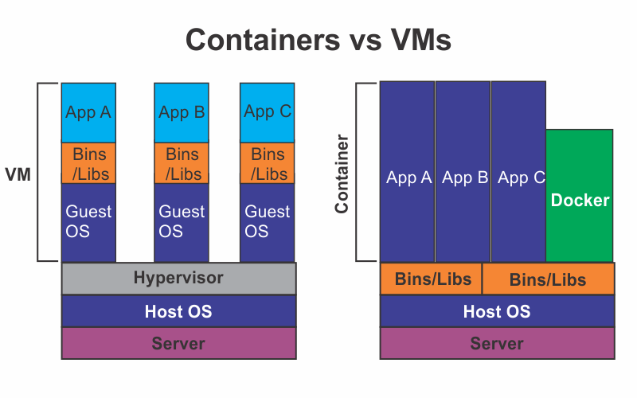

```toc

```



### Virtual Machine

A virtual machine is the digital version of a physical computer. It is software that can perform all the same functions as a physical computer, including running applications and operating systems.

Virtual machines can run programs and operating systems, store data, connect to networks and conduct other computing functions.

Virtual machines are provisioned with the help of a hypervisor, the software layer that virtualizes a host system’s hardware resources such as CPU, memory & networking to allow for a guest OS to be installed.

### Container

In contrast to VMs, containers run directly as processes on the host OS. There are no middle layers as we see in VMs, which helps containers to achieve near-native performance. Also, as containers have a very light footprint, it becomes easier to pack a higher number of containers than VMs on the same physical machine.
