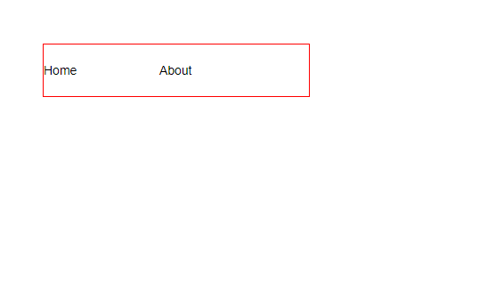
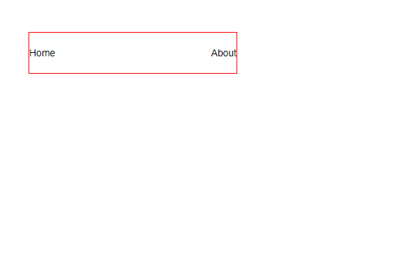

An element with ~~display: none~~ will be completely removed from the web page.

An element with ~~visibility: hidden~~, however, will not be visible on the web page, but the space reserved for it will.

The ~~visibility~~ property can be set to one of the following values:

- **hidden** — hides an element.
- **visible** — displays an element.

**Example**

```html:title=index.html {numberLines}
<ul>
  <li>Home</li>
  <li>About</li>
  <li>Books</li>
</ul>
```

```css:title=style.css {numberLines, 28-28}
* {
  padding: 0;
  margin: 0;
  box-sizing: border-box;
}

html {
  font-size: 10px;
  font-family: sans-serif;
}

ul {
  width: 30rem;
  height: 6rem;
  border: 0.1rem solid red;
  list-style-type: none;
  margin: 5rem;
  display: flex;
  justify-content: space-between;
  align-items: center;
}

ul li {
  font-size: 1.4rem;
}

ul li:last-child {
  visibility: hidden;
}
```



In the example above, the browser _only_ hides the last list item; however, it still leaves an empty space where the element is intended to display.

> Note that you can still view the contents of the list item by viewing the source code in their browser.

Now, if we add the CSS rule of ~~display:none~~, the last item will be completely removed from the web page.

```css {numberLines}
ul li:last-child {
  display: none;
}
```


