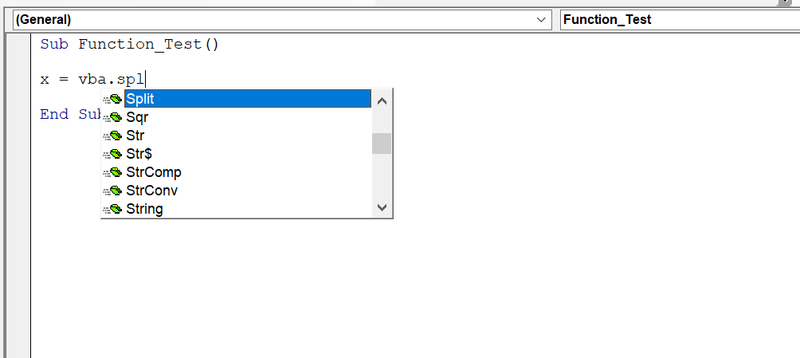

The best way to find out which functions VBA provides is to type ~~VBA~~, followed by a period. You get a list of items, as shown in the following figure:

Those with a green icon are functions. If this feature isn’t working, choose VBE’s Tools ⇒ Options, click the Editor tab, and place a check next to Auto List Members.

