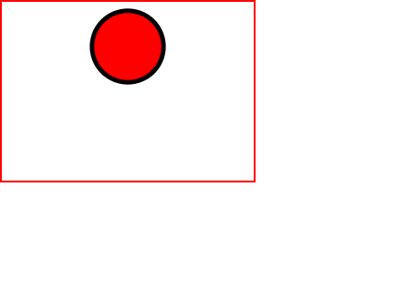

We can draw a circle using the \<circle> element.

```html {numberLines, 11-18}
<!DOCTYPE html>
<html lang="en">
  <head>
    <meta charset="UTF-8" />
    <meta http-equiv="X-UA-Compatible" content="IE=edge" />
    <meta name="viewport" content="width=device-width, initial-scale=1.0" />
    <title>SVG Fundamentals</title>
    <link rel="stylesheet" href="style.css" />
  </head>
  <body>
    <svg width="280px" height="200px" viewBox="0 0 200 200">
      <circle
        cx="100"
        cy="50"
        r="40"
        style="stroke-width: 5; stroke: black; fill: red"
      />
    </svg>
  </body>
</html>
```

```css {numberLines}
svg {
  border: 0.2rem solid red;
}
```



- Specify the center x-coordinate and center y-coordinate with ~~cx~~ & ~~cy~~ respectively. If ~~cx~~ & ~~cy~~ is omitted, they are presumed to be 0.
- Specify the radius with the ~~r~~ attribute. If the radius is 0, no shape will be displayed.
- The default is to fill the circle with black and draw no outline unless you specify some other combination of fill and stroke.
