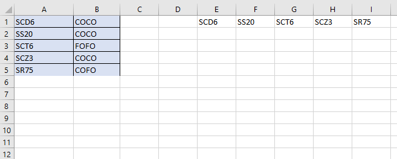

A dynamic array doesn’t have a preset number of elements.

We can declare a dynamic array with an empty set of parentheses:

```vb {numberLines}
Dim DynamicArray () As Integer
```

Before we can use this array, we must use the ~~ReDim~~ statement to tell VBA how many elements the array has.

Usually, the number of elements in the array is determined while our code is running. We can use the ~~ReDim~~ statement any number of times, changing the array’s size as often as needed.

The following example demonstrates how to change the number of elements in a dynamic array. It assumes that the ~~NumElements~~ variable contains a value, which our code calculated.

```vb {numberLines}
ReDim DynamicArray (1 To NumElements)
```

When we redimension an array using ~~ReDim~~, we wipe out any values currently stored in the array elements. We can avoid destroying the old values by using the ~~Preserve~~ keyword.

The following example shows how you can preserve an array’s values when you redimension the array:

```vb {numberLines}
ReDim Preserve DynamicArray (1 To NumElements)
```

If ~~DynamicArray~~ currently has ten elements, and we execute the preceding statement with ~~NumElements~~ equaling 12, the first ten elements remain intact, and the array has room for two additional elements (up to the number contained in the variable ~~NumElements~~). If ~~NumElements~~ equals 7 however, the first seven elements are retained but the remaining three elements meet their demise.

**Example:**

```vb {numberLines}
Sub DynamicArrayDemo()

Dim LastRow As Long

LastRow = Cells(Rows.Count, 1).End(xlUp).Row

Dim i As Long

Dim StoreCode() As String 'Declare a dynamic array named StoreCode

For i = 1 To LastRow
    ReDim Preserve StoreCode(LastRow) As String
    StoreCode(i - 1) = Cells(i, 1).Value
Next i

Range(Cells(1, 5), Cells(1, 5 + LastRow)) = StoreCode

End Sub
```

**Line-9**: We create a dynamic array named ~~StoreCode~~ using an empty set of parantheses.

**Line-11 to 14**: We decide the number of elements the ~~StoreCode~~ array will hold inside the ~~For-Next~~ loop using the ~~ReDim~~ keyword. (_can you figure out what will happen if we remove the ~~Preserve~~ keyword?_ ) Then we loop through the range in column A using the ~~For-Next~~ loop and populate the ~~StoreCode~~ array with the values from the range.

**Line-16**: Next, we paste the elements stored in the ~~StoreCode~~ array in the range that starts with the cell E1. The last cell of the range is determined dynamically based on the value of the ~~LastRow~~ variable, which changes based on the number of store codes in column A.

**Result:**

Executing the ~~Sub~~ procedure above gives us the following result:


