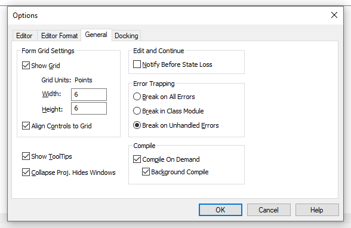
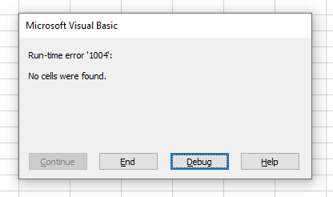

A VBA procedure can throw two kinds of errors:

- **Syntax errors**: You must correct syntax errors before you can execute a procedure.
- **Run-time errors**: Run-time errors occur while a procedure is running.

> **Note:** For error-handling procedures to work, the ~~Break on All Errors~~ setting must be turned off. In VBE, choose **tools > Options** and click the **General** tab in the **Options** dialogue box. If ~~Break on All Errors~~ is selected, VBA ignores your error-handling code. You will usually want to use the ~~Break on Unhandled Errors~~ option.



Normally, a run-time error causes VBA to stop and the user sees a dialogue box that displays the error number and a description of the error.

For example, execution of the following sub procedure displays an error message, because no cell in the current range selection contains a formula.

```vb {numberLines}
Sub SelectFormula()
  ActiveCell.CurrentRegion.Select
  Selection.SpecialCells(xlFormulas).Select
End Sub
```

The error message:



Whenever an error occurs, one of the options we have is to ignore the error and let VBA continue. We can do so by using the following statement:

```vb {numberLines}
On Error Resume Next
```

We can rewrite our _Sub_ procedure above using the ~~On Error Resume Next~~ statement to prevent the error message from appearing:

```vb {numberLines, 2-2}
 Sub SelectFormula()
    On Error Resume Next
    ActiveCell.CurrentRegion.Select
    Selection.SpecialCells(xlFormulas).Select
    On Error GoTo 0
End Sub
```

The ~~On Error GoTo 0~~ statement restores normal error handling for the remaining statements in the procedure.
