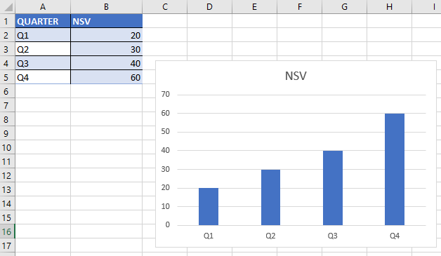

To create a new chart, we use the ~~AddChart2~~ method of the ~~Shapes~~ collection.

The ~~AddChart2~~ method can use seven arguments (all are optional):

- **Style**: A numeric code that specifies the style of the chart
- **xlChartType**: The type of the chart. If omitted, the default chart type is used.
- **Left**: The left position of the chart, in points. If omitted, Excel centers the chart horizontally.
- **Top**: The top position of the chart, in points. If omitted, Excel centers the chart vertically.
- **Width**: The width of the chart, in points. If omitted, Excel uses 354.
- **Height**: The height of the chart, in points. If omitted, Excel uses 210.
- **NewLayout**: A numeric code that specifies the layout of the chart.

Here is a simple procedure that creates a clustered column chart"

_Note that we have not specified the ~~NewLayout~~ argument, so it uses the default value_.

```vb {numberLines}
Sub ColumnChart()

  Dim MyChart As Chart
  Dim DataSource As Range

  Set dataSource = ActiveCell.CurrentRegion
  Set MyChart = ActiveSheet.Shapes.AddChart2 _
  (201, xlColumnClustered, 150, 50, 300, 200).Chart

  MyChart.SetSourceData Source:=DataSource

End Sub
```

This procedure uses two object variables: ~~DataSource~~ (for the ~~Range~~ object that holds the data) and ~~MyChart~~ (for the ~~Chart~~ object).


