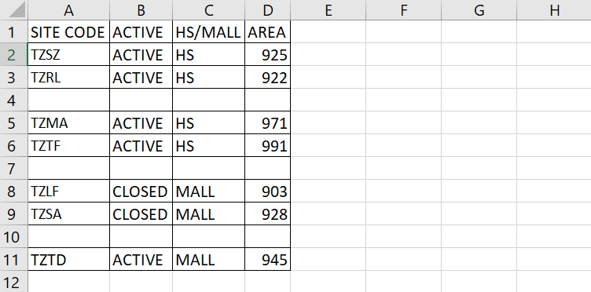
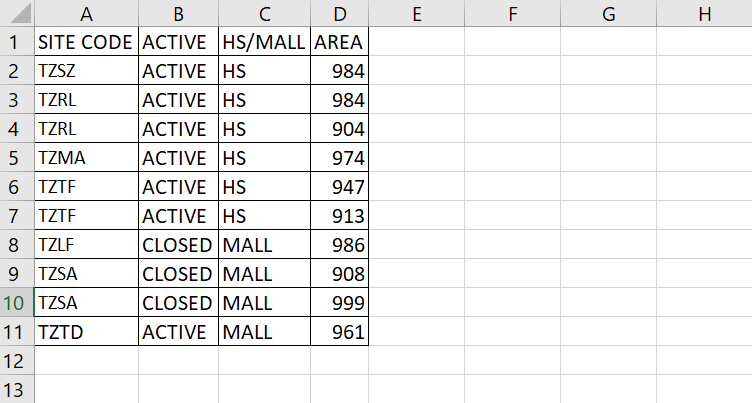

We can fill down the contents and formatting from the top cell or cells in the specified range to the bottom of the range using the ~~FillDown()~~ method.



Executing the following macro for the dataset above

```vb {numberLines}
Sub Filldown_Demo()
Dim columnCount As Long
columnCount = Cells(1, Columns.count).End(xlToLeft).column

For Each Cell In Range("A1:A11")

    If IsEmpty(Cell) Then
        Cell.Resize(1, columnCount).FillDown
    End If

Next Cell

End Sub
```

Gives us the following result:


