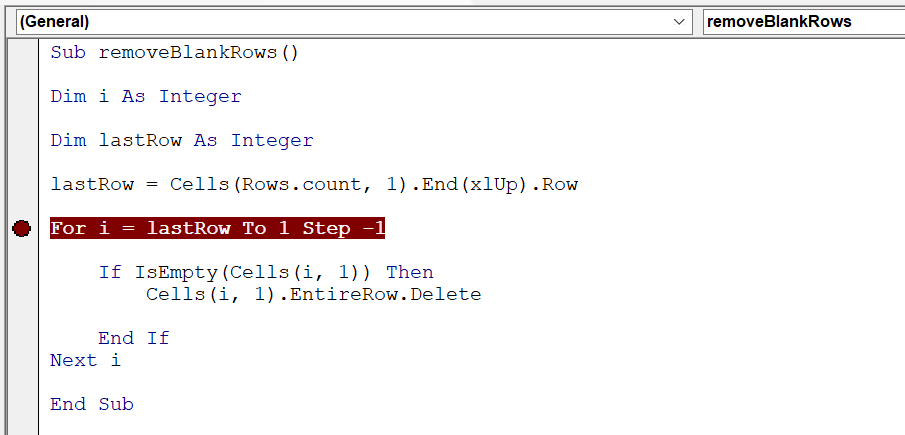

In Excel VBA, another useful debugging tool is the ability to set a breakpoint in your code.

When you set a breakpoint, your code runs as normal and then halts at the line of code where you defined the breakpoint.

This debugging technique comes in handy when you want to run tests on small blocks of code at a time. For example, if you suspect there is an error in your macro but you know that the majority of the macro runs without any problems, you can set a breakpoint starting at the suspect line of code, and then run the macro. When the macros reaches your breakpoint, execution halts. At this point, you can then press F8 to watch as the macro runs one line at a time.

**To set a breakpoint in your code, place your cursor where you want the breakpoint to start, and press F9. As the following figure shows, VBA clearly marks the breakpoint with a dot in the Code window's left margin, and the code line itself is shaded maroon.**

