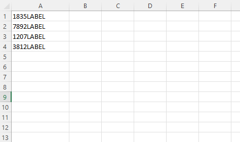

In Excel VBA, we can use the array data structure to store values of different data types. Then, we can loop through the array and write those values to a range.

```vb {numberLines}
Sub insertStoreCodes()

Dim daysofweek

' creating an array using the Array function
daysofweek = Array("1835LABEL", "7892LABEL", "1207LABEL", "3812LABEL")

Dim i As Long
Dim j As Long
Dim arrayLength As Long

arrayLength = UBound(daysofweek) + 1

j = 0

For i = 1 To arrayLength
    Cells(i, 1).Value = daysofweek(j)
    j = j + 1
Next i

End Sub
```

Executing the Sub procedure above gives us the following result:


