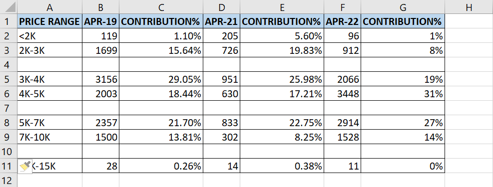

The ~~IsEmpty~~ function returns a Boolean value that indicates whether a single cell is empty: ~~True~~ if empty, and ~~False~~ if not.

The cell must be truly empty for the function to return ~~True~~. If it contains even just a space that you can’t see, Excel does not consider the cell to be empty:

```vb {numberLines}
IsEmpty(Cell)
```

Let’s say we have a dataset with blank rows. The following code snippet goes down the data in column A. When it finds an empty cell, it selects and deletes the row containing that cell.

```vb {numberLines}
Sub Delete_Blank_Rows()

Dim lastRow As Long

lastRow = Cells(Rows.count, 1).End(xlUp).Row

For Each Cell In Range(Cells(1, 1), Cells(lastRow, 1))

    If IsEmpty(Cell) Then
        Cell.EntireRow.Delete Shift:=xlUp
    End If

Next Cell

End Sub
```


