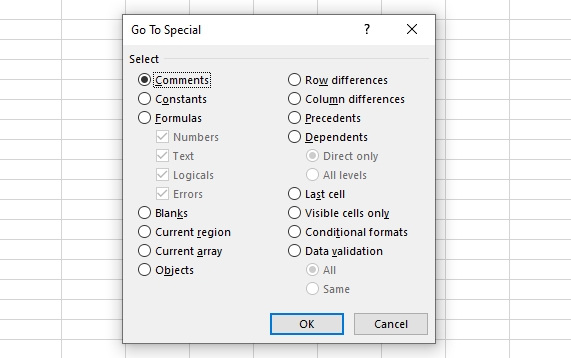
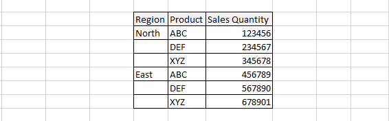
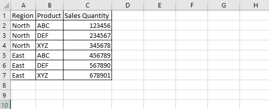

In the Excel interface, the ~~Go To Special~~ dialog box (Home⇒Find & Select⇒Go To Special) has many incredibly useful selection tools that we can use to select cells that meet a certain criteria.



We can simulate the ~~Go To Special~~ dialog box in VBA by using the ~~SpecialCells~~ method, which has the following syntax:

```vb {numberLines}
RangeObject.SpecialCells(Type, Value)
```

The ~~SpecialCells~~ method has two parameters: ~~Type~~ and ~~Value~~. ~~Type~~ is one of the ~~xlCellType~~ constants:

- xlCellTypeAllFormatConditions
- xlCellTypeAllValidation
- xlCellTypeBlanks
- xlCellTypeComments
- xlCellTypeConstants
- xlCellTypeFormulas
- xlCellTypeLastCell
- xlCellTypeSameFormatConditions
- xlCellTypeSameValidation
- xlCellTypeVisible

Set one of the following optional ~~Value~~ constants if you use ~~xlCellTypeConstants~~ or ~~xlCellTypeFormulas~~:

- xlErrors
- xlLogical
- xlNumbers
- xlTextValues

For example, consider the following dataset:



Though the dataset looks tidy, the blank cells in the ~~Region~~ column make it difficult to sort the dataset.

In such a scenario, we can use the ~~SpecialCells~~ method to fill the blank region cells quickly using the region found above them.

```vb {numberLines}
Sub FillIn()

On Error Resume Next

Range("A1").CurrentRegion.SpecialCells(xlCellTypeBlanks).FormulaR1C1 _
 = "=R[-1]C"

Range("A1").CurrentRegion.Value = Range("A1").CurrentRegion.Value

End Sub
```

In this code snippet above, ~~Range("A1").CurrentRegion~~ refers to the contiguous range of data in the report.

The ~~SpecialCells~~ method returns just the blank cells in that range. This particular formula fills in all the blank cells with a formula that points to the cell above the blank cell. The code snippet on line 8 is a fast way to simulate using the Copy and Paste Special Values commands.

The following figure shows the results:



After the macro runs, the blank cells in the ~~Region~~ column have been filled with data.
