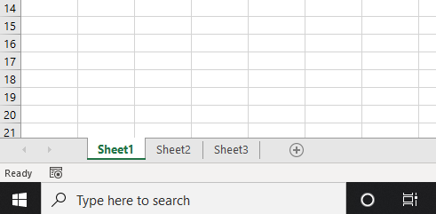
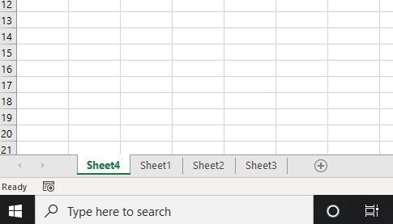

```toc

```

### Add

We can add a new worksheet to the active workbook by using the ~~Add~~ method.

Below, our workbook has three sheets: Sheet1, Sheet2, and Sheet3, with Sheet1 as the active sheet.



The following procedure will add a new worksheet named Sheet 4, before the original active sheet.

```vb {numberLines}
Sub WorksheetDemo()

Worksheets.Add

End Sub
```



### Renaming a worksheet

Our workbook has four sheets. We can display the name of the first worksheet using the ~~Name~~ property.

```vb {numberLines}
Sub WorksheetDemo()

Debug.Print Worksheets(1).Name

End Sub

' Sheet4
```

Note that the name of a worksheet is a read-write property. Therefore, we can change the name of the worksheet name as well using the ~~Name~~ property.

The following procedure renames the first worksheet to ~~Data~~.

```vb {numberLines}
Sub WorksheetDemo()

Worksheets(1).Name = "Data"

End Sub
```

### Activate

We can make any of the worksheets the active sheet using the ~~Activate~~ property.

```vb {numberLines}
Sub WorksheetDemo()

Worksheets("Sheet2").Activate

End Sub
```

### Delete

We can delete a worksheet using the ~~Delete~~ method.

```vb {numberLines}
Sub WorksheetDemo()

Worksheets("Sheet2").Delete

End Sub
```

### Copy

We can copy a worksheet either to a new workbook or to the same workbook using the ~~Copy~~ method.

```vb {numberLines}
Sub WorksheetDemo()

Worksheets("Data").Copy

End Sub
```

> Note that copying a worksheet without specifying a destination creates a new workbook that includes the copy.

We can also tell Excel where to put the new copy - before or after the specified worksheet - by using the ~~Before~~ and ~~After~~ arguments respectively.

The following procedure copies the worksheet named ~~Data~~ and places it after the worksheet named ~~Sheet3~~.

```vb {numberLines}
Sub WorksheetDemo()

Worksheets("Data").Copy After:=Sheet3

End Sub
```
