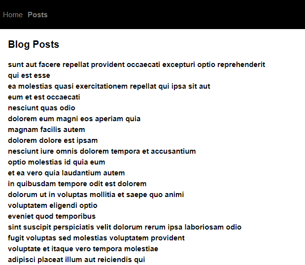

```toc

```

We can fetch data from an API using the ~~useEffect()~~ hook.

The function signature of ~~useEffect~~ is as follows:

```sh
useEffect(effectCallback, dependencies)
```

- ~~useEffect~~ accepts a function definition as its first argument.
- The second argument is an array of dependencies that dictates when to re-run the ~~useEffect~~ call. (_The ~~useEffect~~ call runs after the first time the component renders and after every rerender._) The dependencies array argument defaults to ~~null~~.

When we call ~~useEffect~~, we are essentially telling React that our component needs to do something after every rerender.

### Fetching data only once

When we want to fetch data only once after a component is mounted (that is added to the DOM), we pass **an empty array** as the second argument to the ~~useEffect~~ call.

In the application below, the ~~Posts~~ page dispalys a list of blog posts fetched from a fake REST API.



In the code examples below, I have used Redux Toolkit to manage the global state of the application.

###### Understand the essential Redux Toolkit concepts in my blog post [here](https://hemanta.io/implement-jwt-based-user-authentication-in-a-mern-stack-app-part-9/).

```js:title=src/index.js {numberLines}
import React from "react";
import ReactDOM from "react-dom";
import "./index.css";
import App from "./App";
import { Provider } from "react-redux";
import store from "./store";
import { BrowserRouter as Router } from "react-router-dom";

ReactDOM.render(
  <Provider store={store}>
    <Router>
      <App />
    </Router>
  </Provider>,
  document.getElementById("root")
);
```

```css:title=src/index.css {numberLines}
* {
  padding: 0;
  margin: 0;
  box-sizing: border-box;
}

html {
  font-size: 62.5%;
  font-family: sans-serif;
}

header {
  width: 100%;
  height: 6rem;
  background-color: black;
}

nav {
  width: 100%;
  height: 100%;
}

nav ul {
  width: 100%;
  height: 100%;
  list-style: none;
  display: flex;
  justify-content: flex-start;
  align-items: center;
  padding: 0 1rem;
}

nav ul li:not(:last-child) {
  margin-right: 1rem;
}

nav a {
  font-size: 1.5rem;
  text-decoration: none;
}

nav a:link,
a:visited {
  color: gray;
}

nav a:hover {
  color: white;
}

nav a:active {
  color: limegreen;
}

main {
  margin: 2rem;
}

.active {
  font-weight: bold;
}

h1 {
  margin-bottom: 2rem;
}

h2 {
  margin-bottom: 0.5rem;
}

```

```js:title=src/App.js {numberLines}
import React from "react";
import { Switch, Route } from "react-router-dom";
import Posts from "./components/Posts";
import Home from "./components/Home";
import Header from "./components/Header";

const App = () => {
  return (
    <>
      <Header />
      <main>
        <Switch>
          {" "}
          <Route path="/posts" exact>
            <Posts />
          </Route>
          <Route path="/" eaxct>
            <Home />
          </Route>
        </Switch>
      </main>
    </>
  );
};

export default App;
```

```js:title=src/store.js {numberLines}
import { configureStore } from "@reduxjs/toolkit";
import postsReducer from "./components/stateSlices/postsSlice";

export default configureStore({
  reducer: {
    posts: postsReducer,
  },
});
```

```js:title=src/components/stateSlices/postsSlice.js {numberLines}
import { createSlice, createAsyncThunk } from "@reduxjs/toolkit";
import axios from "axios";

const initialState = {
  status: "idle",
  posts: [],
  error: null,
};

export const fetchPosts = createAsyncThunk(
  "posts/fetchPosts",
  async (_, { rejectWithValue }) => {
    try {
      const { data } = await axios.get(
        "https://jsonplaceholder.typicode.com/posts"
      );
      return data;
    } catch (error) {
      rejectWithValue(error.repsonse.data);
    }
  }
);

const postsSlice = createSlice({
  name: "posts",
  initialState,
  reducers: {},
  extraReducers: {
    [fetchPosts.pending]: (state, action) => {
      state.status = "loading";
    },
    [fetchPosts.fulfilled]: (state, action) => {
      state.status = "succeeded";
      state.posts = [...action.payload];
    },
    [fetchPosts.rejected]: (state, action) => {
      state.status = "failed";
      state.error = action.payload.message;
    },
  },
});

export default postsSlice.reducer;
```

```js:title=src/components/Header.js {numberLines}
import React from "react";
import { NavLink } from "react-router-dom";

const Header = () => {
  return (
    <header>
      <nav>
        <ul>
          <li>
            <NavLink to="/" exact activeClassName="active">
              Home
            </NavLink>
          </li>
          <li>
            <NavLink to="/posts" activeClassName="active">
              Posts
            </NavLink>
          </li>
        </ul>
      </nav>
    </header>
  );
};

export default Header;
```

```js:title=src/components/Home.js {numberLines}
import React from "react";

const Home = () => {
  return <h1>Welcome to my blog.</h1>;
};

export default Home;
```

```js:title=src/components/Posts.js {numberLines}
import React, { useEffect } from "react";
import { useSelector, useDispatch } from "react-redux";
import { fetchPosts } from "./stateSlices/postsSlice";

const Posts = () => {
  const dispatch = useDispatch();

  useEffect(() => {
    dispatch(fetchPosts());
  }, [dispatch]);

  const { status, error, posts } = useSelector((state) => state.posts);

  return (
    <>
      <h1>Blog Posts</h1>
      {status === "loading" ? (
        "Loading"
      ) : error ? (
        <h2>{error}</h2>
      ) : (
        posts.map((post) => <h2 key={post.title}>{post.title}</h2>)
      )}
    </>
  );
};

export default Posts;
```

###### Master the fundamentals of React Router in my blog post [here](https://hemanta.io/introduction-to-react-router/).
