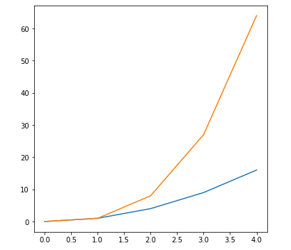

When we have multiple axes in the same picture , we call each set of axes a subplot. This picture or object that contains all of the subplots is called a figure.

We can use the command ~~plt.figure()~~ to create new figures and size them how we want.

We can add the keyword ~~figsize=(width, height)~~ to set the size of the figure, in inches.

To create a figure with a width of 6 inches, and height of 6 inches, we would use:

```py {numberLines, 3-3}
import matplotlib.pyplot as plt

plt.figure(figsize=(6, 6))

plt.plot([0, 1, 2, 3, 4], [0, 1, 4, 9, 16])
plt.plot([0, 1, 2, 3, 4], [0, 1, 8, 27, 64])
```

**Output:**


