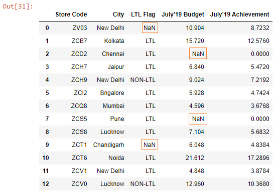
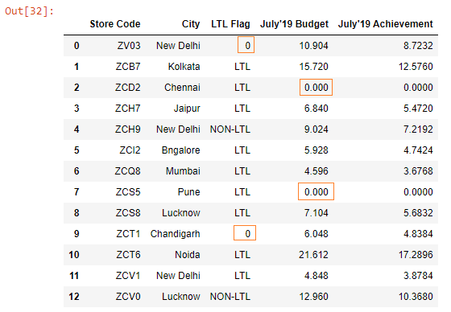
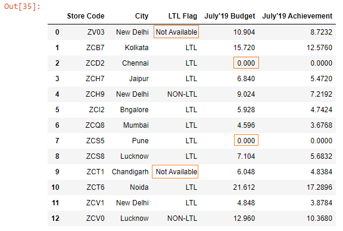
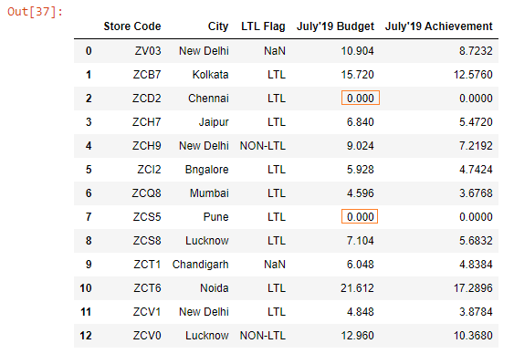

Below, we have read the budget.xlsx file into a DataFrame.

```py {numberLines}
import pandas as pd

budget = pd.read_excel("budget.xlsx")

budget
```

**Output:**



We can see that there are missing values in the ~~LTL Flag~~ and the ~~July’19 Budget~~ columns.

Let’s call the ~~fillna()~~ method on the ~~budget~~ DataFrame.

```py {numberLines}
budget.fillna(value = 0, inplace = True)

budget
```

**Output:**



The missing values in both the columns have been filled with ~~0~~. The value ~~0~~ in the ~~July’19 Budget~~ column makes sense, but not in the ~~LTL Flag~~ column.

Let’s say we want to fill the missing values in the ~~July’19 Budget~~ column with ~~0~~ & in the ~~LTL Flag column~~ with the value ~~Not Available~~.

How can we fill missing values in different columns with different values?

We can achieve this by passing a Python Dictionary to the ~~value~~ parameter.

```py {numberLines}
values = {"LTL Flag" : "Not Available", "July'19 Budget" : 0}

budget.fillna(value = values, inplace = True)

budget
```

The keys in the dictionary are the column names where we want to fill the missing values in and the values in the dictionary are the values that we want the missing values to be filled with.

**Output:**



Note that the ~~fillna()~~ method can be called either on a DataFrame or a Series.

Let’s fill the missing values only in the ~~July’19 Budget~~ column with ~~0~~.

```py {numberLines}
budget["July'19 Budget"].fillna(value = 0, inplace = True)
budget
```

**Output:**


