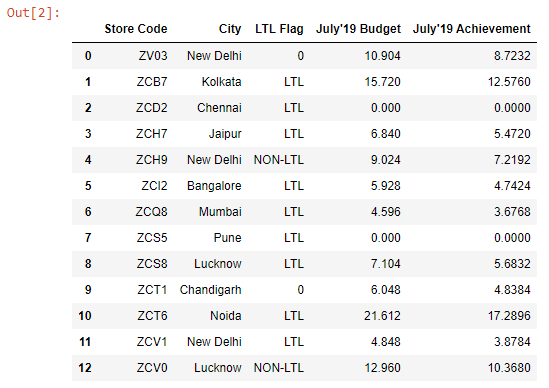

```toc

```

### Single Condition

Let’s read an Excel file into a DataFrame:

```py {numberLines}
import pandas as pd

budget = pd.read_excel("budget.xlsx").fillna(value = 0)

budget
```

Output:



Let’s say we want to extract the stores that are located in New Delhi.

We can filter the DataFrame in 2 steps:

- **Step-1:** Write the filter condition.

```py {numberLines}
condition = budget["City"] == "New Delhi"

condition
```

The result is a new boolean Series.

**Output:**


- **Step-2:** Pass the condition in square brackets that follow the name of the DataFrame

```py {numberLines}
budget[condition]
```

**Output:**


### Multiple conditions

Let’s say we want to extract the stores that are flagged as ~~LTL~~ and have July’19 budget numbers greater than ~~10~~.

We can achieve this using the ~~&~~ logical operator in Pandas.

```py {numberLines}
condition1 = budget["LTL Flag"] == "LTL"

condition2 = budget["July'19 Budget"] > 10

budget[condition1 & condition2]
```

**Output:**


Next, let’s say we want to extract stores that are located either in Mumbai or Bangalore.

We can achieve this using the ~~|~~ (_vertical pipe_) logical operator in Pandas.

```py {numberLines}
condition1 = budget["City"] == "Mumbai"

condition2 = budget["City"] == "Bangalore"

budget[condition1 | condition2]
```

**Output:**


