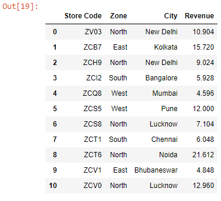
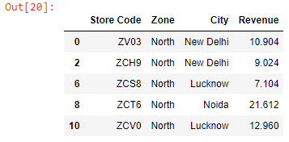
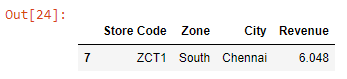

Let’s read an Excel workbook into a DataFrame:

```py {numberLines}
import pandas as pd

data = pd.read_excel("budget.xlsx")

data
```

**Output:**



Let’s say we want to filter all the stores located in the ~~North~~ zone. We can do so using the ~~query()~~ method as shown below:

```py {numberLines}
data.query("Zone == 'North'")
```

**Output:**



Next, let’s filter the store ZCT1:

```py {numberLines}
data.query('`Store Code` == "ZCT1"')
```

**Output:**



> Note: A column name that contains spaces must be surrounded by backticks. This is the reason why the column name ~~Store Code~~ is surrounded by backticks (\` \`).

###### Learn how to filter a Pandas DataFrame based on a condition in my blog post [here](https://hemanta.io/filter-a-pandas-dataframe-based-on-a-condition/).
