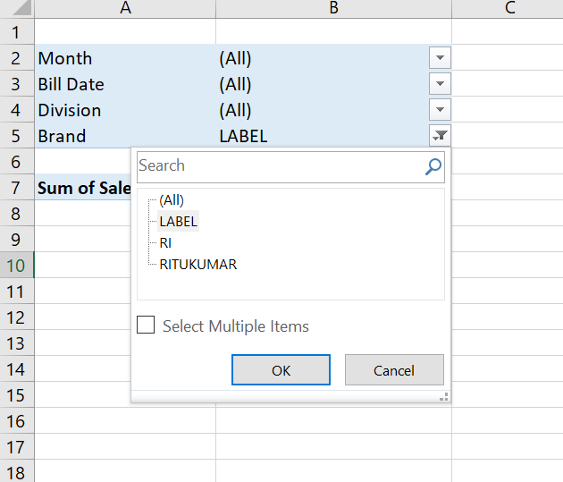

In the PivotTable below, we have a page field named ~~Brand~~.



Let’s say we want to make only the ~~LABEL~~ & ~~RITUKUMAR~~ pivot items visible.

Using VBA, we can achieve this in 2 steps:

- Make sure all the pivot items of the ~~BRAND~~ pivot field are visible.
- Loop through & keep only the ~~LABEL~~ & ~~RITUKUMAR~~ pivot items visible.

```vb {numberLines}
Sub Select_Item()

Dim PT As PivotTable
Set PT = ActiveSheet.PivotTables(1)

For Each PivItem In _
    PT.PivotFields("Brand").PivotItems
    PivItem.Visible = True
Next PivItem

For Each PivItem In _
 PT.PivotFields("Brand").PivotItems
 Select Case PivItem.Name
    Case "LABEL", _
     "RITUKUMAR"
     PivItem.Visible = True
   Case Else
     PivItem.Visible = False
 End Select
Next PivItem

End Sub
```

We can also make all the pivot items of the ~~Brand~~ pivot field visible using the ~~ClearAllFilters~~ method.

Calling this method deletes all filters currently applied to the PivotField. This includes deleting all filters from the ~~PivotFilters~~ collection of the PivotField and removing any manual filtering applied to the PivotField as well.

So, we can rewrite the code block above as shown below:

```vb {numberLines}
Sub Select_Item()
Dim PT As PivotTable
Set PT = ActiveSheet.PivotTables(1)

PT.PivotFields("Brand").ClearAllFilters

For Each PivItem In _
 PT.PivotFields("Brand").PivotItems
 Select Case PivItem.Name
    Case "LABEL", _
     "RITUKUMAR"
     PivItem.Visible = True
   Case Else
     PivItem.Visible = False
 End Select
Next PivItem

End Sub
```
