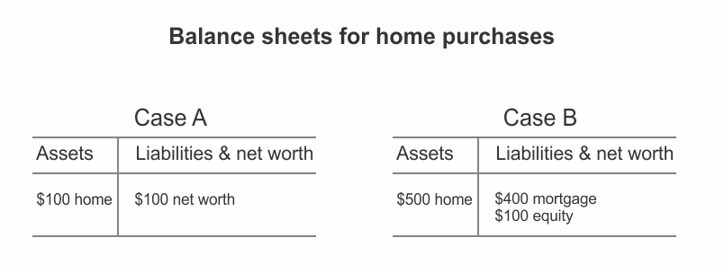

Leverage is one of the most powerful concepts in finance.

In an engineering context, a lever allows you to move a big rock (that you can't possibly move by yourself) by helping you multiply the force you apply to the task. And this is a precise analogue for what happens with leverage in finance. It allows owners to control assets they couldn't control otherwise.

Let's consider your own personal balance sheet after you buy a home.

If you had $100, you could only buy a home that was worth $100. With a mortgage market, you can borrow money to buy a home that is worth, say $500. Under these two circumstances, the balance sheet looks like the following:

The big question is: Are you richer in case A or case B?

The answer is: your wealth is no different; in both cases, you have $100 of shareholders' equity.

Leverage not only allows you to control assets that you have no right to control, but also increases your returns. Imagine that the house increases in value by 10 percent in both the cases. In case A, the value of the house increases to $110; so the return to your shareholders' equity is 10 percent ($10). But in case B, the value of the house increases to $550 and your return is $50 ($500 \* 0.1), which is 50%, assuming that the mortgage remains at $400.

What happens if the house declines in value by 20%?

The return to your shareholders' equity is 20% in case A, but in case B, your return is -100%.

Therefore, managing leverage is critical, because it magnifies your returns in both the directions.
