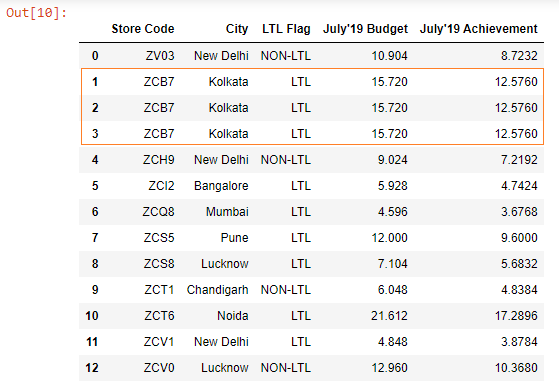
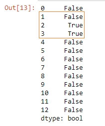
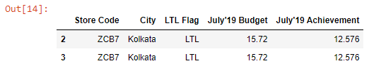

Let’s read the ~~budget.xlsx~~ file into a DataFrame.

```py {numberLines}
import pandas as pd

budget = pd.read_excel("budget.xlsx")

budget
```

**Output:**



We can see that we have duplicate rows in our DataFrame.

We can extract these duplicate rows using the ~~duplicated()~~ method.

```py {numberLines}
duplicates = budget.duplicated()

duplicates
```

The ~~duplicated()~~ method returns a boolean Series.

**Output:**



Note that the first occurrence of the row is marked as ~~False~~ (i.e. non-duplicate).

Next,we extract the duplicate rows as shown below:

```py {numberLines}
budget[duplicates]
```

**Output:**



###### Learn how to remove duplicate rows from a pandas DataFrame in my blog post [here](https://hemanta.io/remove-duplicate-rows-from-a-pandas-dataframe/).
