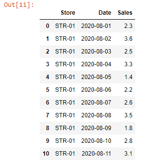
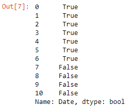
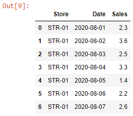

Let’s read the ~~sales.xlsx~~ workbook into a DataFrame.

```py {numberLines}
import pandas as pd

sales = pd.read_excel("sales.xlsx")

sales
```

**Output:**



Let’s say we want to find out the sales in the first week of August, 2020 (i.e. between 1stAugust’20 to 7th August’20).

We can get the desired result using the ~~between()~~ method.

```py {numberLines}
condition = sales["Date"].between("2020-08-01", "2020-08-07")

condition
```

The ~~between()~~ method returns a boolean Series. Moreover, **both the values passed to the method are inclusive.**

**Output:**



Next, we pass the ~~condition~~ variable inside the squared brackets to get the filtered DataFrame.

```py {numberLines}
sales[condition]
```

**Output:**


