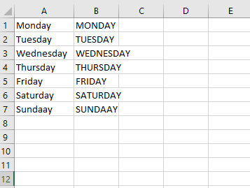

We can loop through each object in a collection of objects using a ~~For Each-Next~~ loop.

The following example loops through each worksheet in the active workbook and deletes the worksheet if its empty.

```vb {numberLines}
Sub DeleteEmptySheets()

Dim ws As Worksheet

Application.DisplayAlerts = False

For Each ws In ActiveWorkbook.Worksheets
    If WorksheetFunction.CountA(ws.Cells) = 0 Then
        ws.Delete
    End If
Next ws

Application.DisplayAlerts = True

End Sub
```

> Note: With the ~~DisplayAlerts~~ setting turned off, Excel will not display a warning, every time a sheet is about to be deleted.

The following example loops through the cells in the range ~~A1:A7~~, converts the cell value to uppercase letters and then assigns that value to the value of the cell to the right.

```vb {numberLines}
Sub UpperCase()

Dim cell As Range

For Each cell In Range("A1:A7")
    cell.Offset(0, 1).Value = UCase(cell.Value)
Next cell

End Sub
```


