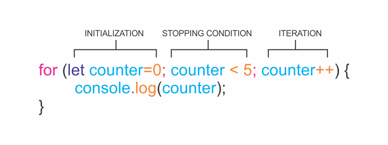

A typical ~~for~~ loop includes an iterator variable, which is initialized, checked against the stopping condition and assigned a new value on each loop iteration.

A ~~for~~ loop contains three expressions separated by ~~;~~ inside the parentheses:

- An _initialization_ starts the loop and can also be used to declare the iterator variable.
- A _stopping condition_ is the condition that the iterator variable is evaluated against – if the condition evaluates to ~~true~~ the code block will run, and if it evaluates to ~~false~~ the code will stop.
- An _iteration statement_ is used to update the iterator variable on each loop.

The ~~for~~ loop syntax looks like this:



```js {numberLines}
for (let counter = 0; counter < 5; counter++) {
  console.log(counter)
}
```

In this example, the output would be the following:

```js {numberLines}
0
1
2
3
4
```
