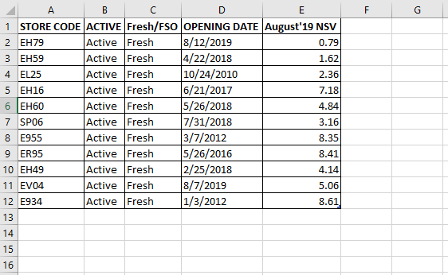
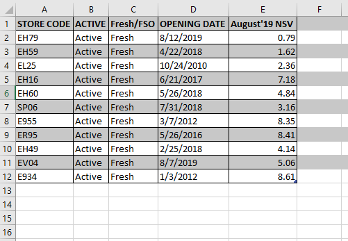

```toc

```

We can repeatedly execute a block of VBA statements using loops.

### For-Next

A ~~For...Next~~ loop is controlled by a counter variable that starts at one value and stops at another value. All the VBA statements between the ~~For~~ and ~~Next~~ statements get repeated in the loop.

In the ~~Sub~~ procedure below, we add all the odd numbers between 1 to 10.

```vb {numberLines}
Sub SumOddNumbers()

Dim Total As Long
Dim i As Long

Total = 0

For i = 1 To 10
    ' Check if i is divisible by 0
    If i Mod 2 <> 0 Then
        Total = Total + i
    End If
Next i

Debug.Print Total

End Sub
```

###### Learn about equality & inequality operators in my blog post [here](https://hemanta.io/equality-and-inequality-operator-in-vba/).

###### Learn how to control program flow in Excel VBA in my blog post [here](https://hemanta.io/controlling-program-flow-in-excel-vba/).

### For-Next with a Step

We can use a ~~Step~~ value to skip some counter values in a ~~For-Next~~ loop.

Let’s say we have the following data set in an Excel worksheet.



We can color alternate rows of the data set using the code snippet below:

```vb {numberLines}
Sub ColorAlternateRows()

Dim i As Long
Dim lastRow As Long

lastRow = Cells(Rows.Count, 1).End(xlUp).Row

For i = 1 To lastRow Step 2
    Rows(i).Interior.Color = RGB(200, 200, 200)
Next i

End Sub
```


