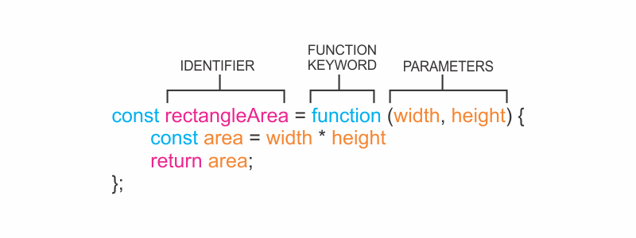

###### Learn how to define functions using function declarations in my blog post [here](https://hemanta.io/an-introduction-to-javascript-functions/).

In JavaScript, one of the ways to define a function is to use a _function expression_.

To define a function inside an expression, we can use the ~~function~~ keyword. In a function expression, the function name is usually omitted. A function with no name is called an _anonymous function_. A function expression is often stored in a variable in order to refer to it.

Consider the following function expression:



To declare a function expression:

- Declare a variable to make the variable’s name be the name, or identifier, of your function. Since the release of ES6, it is common practice to use ~~const~~ as the keyword to declare the variable.

- Assign as that variable’s value an anonymous function created by using the ~~function~~ keyword followed by a set of parentheses with possible parameters. Then a set of curly braces that contain the function body.

To invoke a function, write the name of the variable in which the function is stored followed by parentheses enclosing any arguments being passed into the function.

**Example:**

```js {numberLines}
const rectangleArea = function (width, height) {
  const area = width * height
  return area
}

console.log(rectangleArea(6, 2))
// 12
```

> **Note:** Unlike function declarations, function expressions are not hoisted; so they can’t be called before they are defined.
