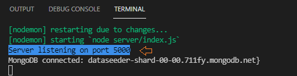

```toc

```

I always use the ~~colors~~ module to get style and color in the Node.js console while developing full-stack applications.

### Installation

```sh {numberLines}
npm install colors
```

### Usage

The following code snippet is an example of how we spin up a server using Express.

```js:title=server/index.js {numberLines, 4-4, 31-31}
const express = require("express");
const mongoose = require("mongoose");
const dotenv = require("dotenv");
const colors = require("colors");

dotenv.config();

const connectDB = async () => {
  try {
    const conn = await mongoose.connect(process.env.MONGO_URI, {
      useNewUrlParser: true,
      useUnifiedTopology: true,
    });

    console.log(`MongoDB connected: ${conn.connection.host}}`);
  } catch (error) {
    console.error(`Error: ${error.message}`);
    process.exit(1);
  }
};

connectDB();

const app = express();

app.use(express.json());

const PORT = 5000;

app.listen(PORT, () => {
  console.log(`Server listening on port ${PORT}`.bgBrightBlue.black);
});
```

When I execute the file using the command ~~node index.js~~, we will see that the message - Server listening on port 5000 - is logged to the console with a bright blue background and black text.



You can customise the color and style according to your own preferences. To find out more about the options available, check out the link [here](https://www.npmjs.com/package/colors).
