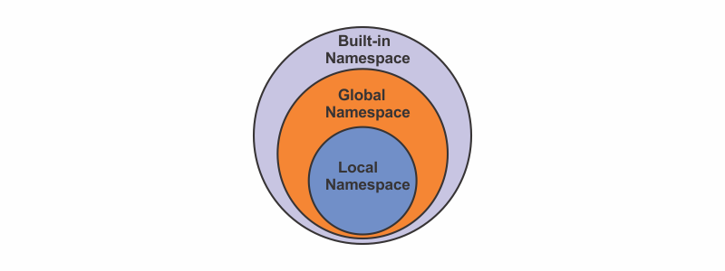

The _global namespace_ exists one level below the built-in namespace.

###### Learn about the built-in namespace in my blog post [here](https://hemanta.io/builtin-namespace-in-python/).

It includes all the non-nested names in the module (file) we are choosing to run the Python interpreter on.

The global namespace is created when we run our main program and has a lifetime until the interpreter terminates (_usually when our program is finished running_).

In order to see the objects that exist in the global namespace, Python provides the ~~globals()~~ built-in function.

> **Note:** The ~~globals()~~ function actually comes from the built-in namespace (_and is thus called a built-in function_) and can be accessed from anywhere in our program (or any program).

Lets call ~~globals()~~ inside of a ~~print()~~ function to observe the current global namespace.

```py {numberLines}
print(globals())
```

Would output:

```py {numberLines}
{'__name__': '__main__', '__doc__': None, '__package__': None, '__loader__': <_frozen_importlib_external.SourceFileLoader object at 0x000002D6D2B9A100>, '__spec__': None, '__annotations__': {}, '__builtins__': <module 'builtins' (built-in)>, '__file__': 'c:\\Users\\Delhivery\\Desktop\\hello\\hello.py', '__cached__': None}
```

Now, let’s add some Python code and see how the namespace changes:

```py {numberLines}
import random

first_name = "Hemanta"
last_name = "Sundaray"


def greeting(name):
    random_number = random.randint(0, 9)
    print(first_name)
    print(f"Hello {name}")
    print(random_number)


print(globals())
```

```py {numberLines}
{'__name__': '__main__', '__doc__': None, '__package__': None, '__loader__': <_frozen_importlib_external.SourceFileLoader object at 0x000001CD0BECA100>, '__spec__': None, '__annotations__': {}, '__builtins__': <module 'builtins' (built-in)>, '__file__': 'c:\\Users\\Delhivery\\Desktop\\hello\\hello.py', '__cached__': None, 'random': <module 'random' from 'C:\\Users\\Delhivery\\AppData\\Local\\Programs\\Python\\Python39\\lib\\random.py'>, 'first_name': 'Hemanta', 'last_name': 'Sundaray', 'greeting': <function greeting at 0x000001CD0BEFEF70>}
```

We can see that the global namespace contains all of the non-nested objects of our program. This includes the variables ~~first_name~~ and ~~last_name~~ as well as the function ~~greeting~~. However, the ~~random_number~~ variable is not included in the namespace because it is nested inside of our ~~greeting~~ function.

Also, note that any time we use the ~~import~~ statement to bring in a new module into our program, instead of adding every name from that module (such as all names in the ~~random~~ module), Python will create a new namespace for it.

This means that there might be potentially multiple global namespaces in a single program. This will be masked away from us in the format seen with the random module ~~<module 'random' from 'C:\\Users\\Delhivery\\AppData\\Local\\Programs\\Python\\Python39\\lib\\random.py'>~~.
