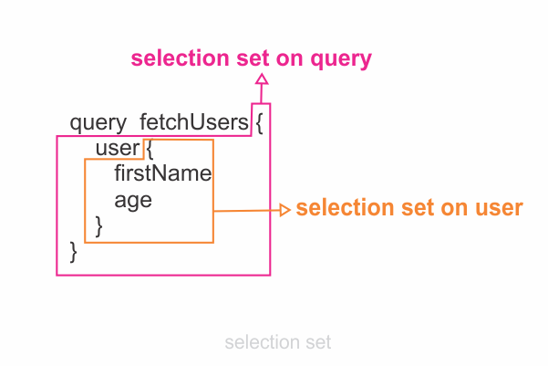
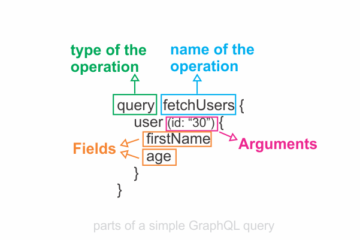
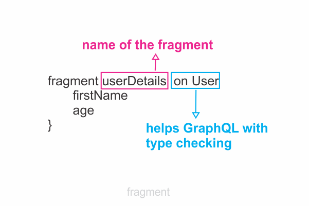

```toc

```

There are three types of GraphQL operations: **query**, **mutation** & **subscription**.

A query describes the data you want to fetch from a GraphQL server. It is written using the GraphQL query language and is sent to the server as a string inside a JSON object.

### Syntax

- We can write a query using a shorthand syntax where we omit the keyword query (_operation type_) and the name of the query (_operation name_).

```sh
{
  user {
   firstName
   age
  }
}
```

- We can also write a query by using the keyword ~~query~~ but omitting the name of the query.

```sh
query {
  user {
    firstName
    age
  }
}
```

- However, it’s always a good practice to write a query using both the keyword ~~query~~ and the name of the query. That way, we can easily identify a query - especially useful for debugging our code. Below, ~~fetchUsers~~ is the name of our query.

```sh
query fetchUsers {
   user {
     firstName
     age
   }
}
```

### Selection set

When we write a query, we select the fields we need by encapsulating them in curly braces. These blocks are referred to as ~~selection sets~~.



When a query gets executed successfully, the response becomes available as a JSON object as the value of the ~~data~~ key. The response has exactly the same shape as the query. The shape of the response data is exactly shaped after the structure of fields being requested in the query.

### Query Arguments

```sh {numberLines, 2}
query fetchUsers {
   user (id: “30”) {
     firstName
     age
   }
}
```

We can filter the results of a GraphQL query by passing arguments to fields. An argument is a set of key-value pairs attached to a specific field. Arguments can appear on any field, even on fields nested deep inside an operation. Above, we want to fetch a user with an ~~id~~ of 30.

### Parts of a query



A field is a unit of data you ask for. The field ends up as a field in the response data we receive from the server.

### Fragments

Fragments are selection sets that can be used in multiple operations.



We define fragments by using the ~~fragment~~ keyword followed by the name of the fragment. Fragments are selection sets on specific types. Therefore, in the definition, we must also specify the type associated with the fragment.

```sh {numberLines, 3-3, 7-10}
query fetchUsers {
    user (id: "40") {
        ...userDetails
    }
}

fragment userDetails on User {
    firstName
    age
}
```

Above, the fragment is a selection set on the User type.

We can add a fragment in another selection set by using three dots(~~...~~) followed by the name of the fragment (_line 3_). The three dots instruct GraphQL to assign the fields from the fragment to the current selection set.

The syntax is similar to the JavaScript spread operator.

---

**Want to learn how to build an Express/GraphQL server?**

Check out my 8-part blog series [here](https://hemanta.io/how-to-build-an-express-graphql-server-part-one/).
