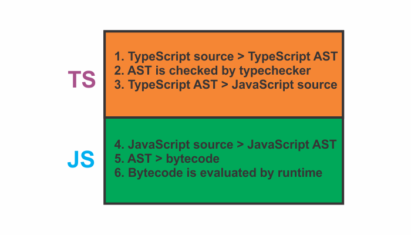

###### The following blog post is a summary of **chapter 2. TypeScript: A 10_000 Foot View**, from the book **Programming Typescript** by Boris Cherny

For most languages, whenever we run a program, it goes through the following steps:

- The program is parsed by a special program called a compiler, which transforms it into an abstract syntax tree (AST).
- The compiler then converts the AST into a low-level representation called bytecode.
- The bytecode is then fed into another program called a runtime for evaluation.

So, whenever we run a program, we essentially ask the runtime to evaluate the bytecode generated by the compiler from the AST parsed from our source code. This is an accurate overview for most languages.

TypeScript however, instead of compiling straight to bytecode, compiles to JavaScript code. We then run the JavaScript code in the browser or with Node.js (a JavaScript runtime built on Chrome’s V8 engine ).

**When does type checking happen?**

After the TypeScript compiler generates an AST but before compiling to JavaScript code, it type-checks our code.

So, the process of compiling and running TypeScript can be represented as follows:

> Typechecker is a special program that verifies that our code is typesafe.

Steps 1-3 are done by the TypeScript compiler and steps 4-6 are done by the JavaScript runtime that lives in your browser, NodeJS or whatever JavaScript engine you’re using.

> JavaScript compilers and runtimes tend to be smushed into a single program called an engine.
