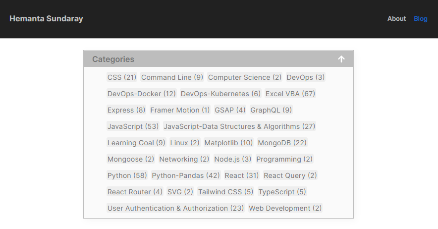
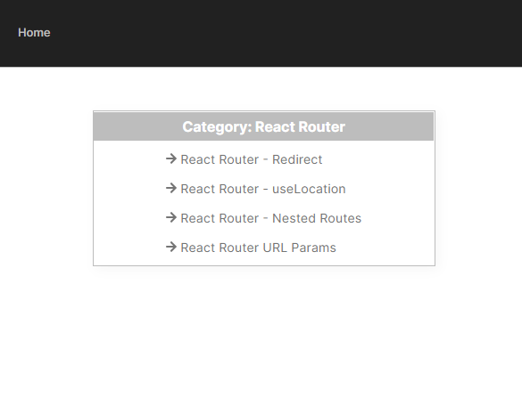
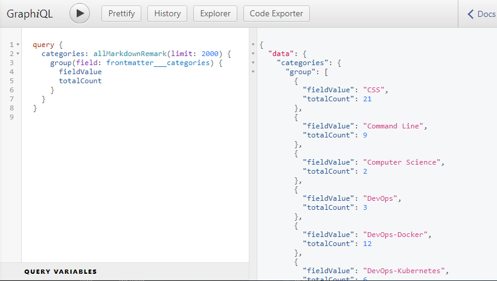

```toc

```

I always wanted to add categories to my blog posts, so that visitors to my blog are able to browse the posts by category. After procrastinating for months, I was finally able to implement the feature the day before yesterday.

On the home page of my blog, you will see a list of categories:



Clicking on a category will take you to a category page with a list of blog posts classified under that category.



Follow the steps below if you want to add categories to your blog posts:

### Adding Categories

The first thing we need to do is to add a new field named ~~categories~~ to the front matter in our Markdown blog posts.

A single post can fall under multiple categories. Therefore, the value of the ~~category~~ field will be an array.

**Example:**

```md
---
title: "An Introduction to Redux Toolkit"
date: "2022-07-25"
excerpt: "Global state management without tears"
categories: ["React", "Redux Toolkit"]
---
```

Go ahead and add the ~~categories~~ field in a few of your blog posts.

Now that we have added a ~~categories~~ field in the front matter section of a few of our blog posts, let’s access this field using the query below:

```sh {numberLines}
allMarkdownRemark {
	group(field: frontmatter___categories) {
	  category: fieldValue
	  totalCount
    }
}
```

The ~~group~~ field used here causes the query to group all blog posts by the ~~categories~~ field before returning each category with the number of posts in the ~~totalCount~~ field.

Now, run the Gatsby development server and access GraphiQL (the GraphQL integrated development environment) at localhost:8000/\_\_\_graphql.

We will use the GraphiQL IDE to issue our query and see what response we get.



We now have a full list of categories in our blog posts, as well as the count of blog posts per category. We can access the categories array at ~~data.categories.group~~. Then we can iterate over this array and render a list of categories and the total count wherever we want.

### Adding a category page template

The next step is to create a category page template for each individual category and use it within ~~createPages~~ in ~~gatsby.node.js~~ to generate individual category pages.

Inside the ~~src/templates~~ directory, create a file named ~~categories.js~~ and insert the following code.

```js:title=src/templates/categories.js {numberLines}
import React from "react"
import { Link, graphql } from "gatsby"

const Categories = ({ pageContext, data }) => {
  const { category } = pageContext
  const { edges } = data.allMarkdownRemark
  const categoryHeader = `Category: ${category}`

  return (
      <div>
        <h1>{categoryHeader}</h1>
        <ul>
          {edges.map(({ node }) => {
            const { slug } = node.fields
            const { title } = node.frontmatter
            return (
              <li key={slug}>
                <Link to={slug}>{title}</Link>
              </li>
            )
          })}
        </ul>
      </div>
  )
}

export default Categories

export const pageQuery = graphql`
  query($category: String) {
    allMarkdownRemark(
      limit: 2000
      sort: { fields: [frontmatter___date], order: DESC }
      filter: { frontmatter: { categories: { in: [$category] } } }
    ) {
      totalCount
      edges {
        node {
          fields {
            slug
          }
          frontmatter {
            title
          }
        }
      }
    }
  }
`
```

The next thing we need to do is to instruct Gatsby to use this category page template to programmatically create the category pages we need.

### Programmatic category page creation with gatsby.node.js

My ~~gatsby.node.js~~ file looks like the following:

```js:title=gatsby.node.js {numberLines, 2-2, 21-21, 36-36, 62-72}
const path = require(`path`)
const _ = require("lodash")
const { createFilePath } = require(`gatsby-source-filesystem`)

exports.onCreateNode = ({ node, getNode, actions }) => {
  const { createNodeField } = actions
  if (node.internal.type === `MarkdownRemark`) {
    const slug = createFilePath({ node, getNode, basePath: `pages` })
    createNodeField({
      node,
      name: `slug`,
      value: slug,
    })
  }
}

exports.createPages = async ({ actions, graphql, reporter }) => {
  const { createPage } = actions
  const result = await graphql(`
    {
      postsRemark: allMarkdownRemark(
        sort: { order: DESC, fields: [frontmatter___date] }
        limit: 2000
      ) {
        edges {
          node {
            fields {
              slug
            }
            frontmatter {
              modules
            }
          }
        }
      }
      categoriesGroup: allMarkdownRemark(limit: 2000) {
        group(field: frontmatter___categories) {
          fieldValue
        }
      }
    }
  `)
  // handle errors
  if (result.errors) {
    reporter.panicOnBuild(`Error while running GraphQL query.`)
    return
  }
  const posts = result.data.postsRemark.edges

  posts.forEach(({ node }, index) => {
    createPage({
      path: node.fields.slug,
      component: path.resolve(`./src/templates/blog-post.js`),
      context: {
        slug: node.fields.slug,
        prev: index === 0 ? null : posts[index - 1].node,
        next: index === posts.length - 1 ? null : posts[index + 1].node,
      },
    })
  })

  const categories = result.data.categoriesGroup.group
  // Make category pages
  categories.forEach(category => {
    createPage({
      path: `/categories/${_.kebabCase(category.fieldValue)}/`,
      component: path.resolve("src/templates/categories.js"),
      context: {
        category: category.fieldValue,
      },
    })
  })
}
```

- **LINE-2:** Make sure to install the ~~lodash~~ library, which contains a utility for converting strings to ~~kebab-case~~.

- **LINE-21 & LINE-36:** Because both blog posts and categories require us to access the ~~allMarkdownRemark~~ field, we have aliased the first ~~allMarkdownRemark field~~, which returns blog posts from Markdown files, to ~~postsRemark~~ and the second ~~allMarkdownRemark~~ field to ~~categoriesGroup~~.

- **LINE-62-72:** We add our individual category page template as a constant just below the blog post page template, referring to the location of the category page template (~~src/templates/categories.js~~).

Finally, our code culminates in a ~~forEach~~ loop that invokes ~~createPage~~ for each given category. The category template we created earlier is used to generate the new individual category pages, located at ~~/categories/{category}~~, where ~~{category}~~ is the category name converted to kebab-case.

Note that we’ve passed ~~category.fieldValue~~ into the ~~createPage~~ invocation through the ~~context~~ object. This is the value that is used in the ~~src/templates/categories.js~~ template by GraphQL to limit our search to only posts that carry that category. If we revisit the GraphQL query in ~~src/templates/categories.js~~, we can see that ~~category.fieldValue~~, found in ~~gatsby-node.js~~, is passed in as the ~~$category~~ query variable on line 2:

```js:title=src/templates/categories.js {numberLines, 2-2}
export const pageQuery = graphql`
  query($category: String) {
    allMarkdownRemark(
      limit: 2000
      sort: { fields: [frontmatter___date], order: DESC }
      filter: { frontmatter: { categories: { in: [$category] } } }
    ) {
      totalCount
      edges {
        node {
          fields {
            slug
          }
          frontmatter {
            title
          }
        }
      }
    }
  }
`
```

Now that we have working individual category pages, we can move on to render the list of categories.

Where you decide to show the list of categories is up to you. In my case, I have the categories list on my home page. You can decide to show the categories list on a separate page if you wish.

Because my home page has lots of features, my ~~index.js~~ file is fairly complex. So, instead of copying the whole file, I have extracted only those code snippets that are relevant to adding the categories feature in our blog.

```js:title=src/index.js {numberLines}
import React from "react";
import { Link, graphql } from "gatsby";
import Layout from "../components/layout";
const _ = require("lodash");

const Home = ({ data }) => {
  const categories = data.categories.group;

  return (
    <div>
      <Layout />
      <div className="categories">
        <h2>Categories</h2>
        <ul>
          {categories.map((category) => (
            <li key={category.fieldValue}>
              <Link to={`/categories/${_.kebabCase(category.fieldValue)}/`}>
                {category.fieldValue} ({category.totalCount})
              </Link>
            </li>
          ))}
        </ul>
      </div>
    </div>
  );
};

export default Home;

export const query = graphql`
  query {
    allMarkdownRemark(limit: 2000) {
      group(field: frontmatter___categories) {
        fieldValue
        totalCount
      }
    }
  }
`
```

With this, adding categories to our Markdown blog posts is complete. In case you face any issue implementing the feature, let me know in the comments below.

```

```
