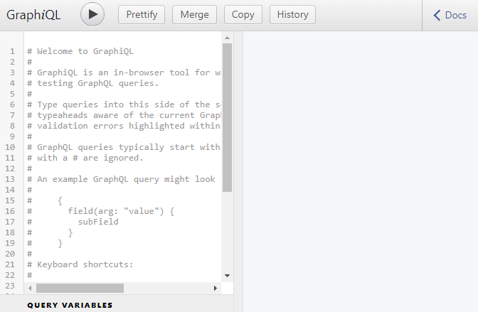

```toc

```

###### This blog post is part of a series. You must finish [part-1](https://hemanta.io/how-to-build-an-express-graphql-server-part-one/) before continuing here.

## GraphQL schema

Because the shape of a GraphQL query closely matches the result, you can predict what the query will return without knowing that much about the server. But it's useful to have an exact description of the data we can ask for - what fields can we select? What kinds of objects might they return? What fields are available on those sub-objects? That's where the schema comes in.

Every GraphQL service defines a set of types which completely describe the set of possible data you can query on that service. Then, when queries come in, they are validated and executed against that schema.

## Defining a UserType

Inside the ~~server~~ directory make a file named ~~schema.js~~ and paste the following code.

```js:title=server/schema.js {numberLines}
const graphql = require("graphql");

const { GraphQLString, GraphQLObjectType, GraphQLInt } = graphql;

const UserType = new GraphQLObjectType({
  name: "User",
  fields: {
    id: { type: GraphQLString },
    firstName: { type: GraphQLString },
    age: { type: GraphQLInt },
  },
});
```

**LINE-1**: We have required in the ~~graphql~~ library.

**LINE-5**: We have created a new object called ~~UserType~~ using ~~GraphQLObjectType~~ to instruct GraphQL about the presence of a user in our application. The user has three properties: ~~id~~, ~~firstName~~ & ~~age~~.

~~UserType~~ informs GraphQL what a user object looks like.

The object we pass in to ~~GraphQLObjectType~~ has 2 required properties: ~~name~~ & ~~fields~~

- **name**: The ~~name~~ property will always be a string that describes the type that we are defining. By convention, we capitalize the first letter of the value of the ~~name~~ property.
- **fields**: The second required property is the ~~fields~~ property whose value is an object. With the ~~fields~~ property we tell GraphQL that every user will have an ~~id~~, ~~firstName~~ and ~~age~~ property. We also tell GraphQL about the type of those fields by setting the values of each of these properties to an object and then defining a ~~type~~ property.

## Defining a root query

We have defined the data type of a user in our schema file. It’s ~~UserType~~.

Now we will define a root query that will allow us to jump and land on a specific node in our graph of data. We can think of the root query as an entry point to our data.

If we want to find a user, let's say, with an ~~id~~ of 23, we are going to pass that instruction to the root query. The root query will contain some logic that will tell the root query where to jump to inside the graph.

Update the ~~schema.js~~ file with the following code snippet.

```js:title=schema.js {numberLines, 14-24}
const graphql = require("graphql")

const { GraphQLString, GraphQLObjectType, GraphQLInt } = graphql

const UserType = new GraphQLObjectType({
  name: "User",
  fields: {
    id: { type: GraphQLString },
    firstName: { type: GraphQLString },
    age: { type: GraphQLInt },
  },
})

const RootQuery = new GraphQLObjectType({
  name: "RootQueryType",
  fields: {
    user: {
      type: UserType,
      args: { id: { type: GraphQLString } },
      resolve(parentValue, args) {
      },
    },
  },
});
```

On line 14, we have declared a new variable called ~~RootQuery~~. We have passed two properties - ~~name~~ & ~~fields~~ - to ~~GraphQLObjectType~~.

The ~~RootQuery~~ is essentially saying that if you are looking for a user and you give me an ~~id~~, I will give back to you a user.

The ~~resolve()~~ function is where we enter into our database and actually find the data we are looking for. It's job is to actually reach out to a database or a third party API and fetch the data.

We will understand the usage of ~~parentValue~~ (_first argument to the ~~resolve()~~ function_) later on in the series.

The second argument passed to the ~~resolver~~ function is ~~args~~. This is an object that gets called with whatever arguments we have passed to the original query. In other words, if our query is expected to be provided with an ~~id~~ of the user that we are trying to fetch, that ~~id~~ will be present in the ~~args~~ object.

## Defining a datastore

We will not use any database here. To keep things simple, we will hard code a list of users. Then, inside the ~~resolve()~~ function, we will write a simple logic that will instruct GraphQL to search through the list of users and return a user whose ~~id~~ matches the ~~id~~ in the query.

Update the ~~schema.js~~ file as follows:

```js:title=server/schema.js {numberLines, 2-2, 6-9, 27-27}
const graphql = require("graphql");
const _ = require("lodash");

const { GraphQLString, GraphQLObjectType, GraphQLInt } = graphql;

const users = [
  { id: "12", firstName: "Bill", age: "35" },
  { id: "20", firstName: "Seth", age: "25" },
];

const UserType = new GraphQLObjectType({
  name: "User",
  fields: {
    id: { type: GraphQLString },
    firstName: { type: GraphQLString },
    age: { type: GraphQLInt },
  },
});

const RootQuery = new GraphQLObjectType({
  name: "RootQueryType",
  fields: {
    user: {
      type: UserType,
      args: { id: { type: GraphQLString } },
      resolve(parentValue, args) {
        return _.find(users, { id: args.id });
      },
    },
  },
});
```

> **Note**: The ~~RootQuery~~ has the expectation of receiving an ~~id~~. So, when an ~~id~~ is provided to the query, it will also be present in the ~~args~~ object. This is how, we are able to access the ~~id~~ of the user we are looking for inside the code block of the ~~resolve()~~ function.

Next, we will merge the ~~UserType~~ and the ~~RootQuery~~ into a schema object and pass the schema object to the ~~expressGraphQL~~ middleware.

We are going to import a helper from the ~~graphql~~ library named ~~GraphQLSchema~~. ~~GraphQLSchema~~ takes in a root query and returns a GraphQL schema instance.

Add the highlighted code snippets in ~~schema.js~~ file.

```js:title=server/schema.js {numberLines, 4-4, 33-35}
const graphql = require("graphql")
const _ = require("lodash")

const { GraphQLString, GraphQLObjectType, GraphQLInt, GraphQLSchema } = graphql

const users = [
  { id: "12", firstName: "Bill", age: "35" },
  { id: "20", firstName: "Seth", age: "25" },
]

const UserType = new GraphQLObjectType({
  name: "User",
  fields: {
    id: { type: GraphQLString },
    firstName: { type: GraphQLString },
    age: { type: GraphQLInt },
  },
})

const RootQuery = new GraphQLObjectType({
  name: "RootQueryType",
  fields: {
    user: {
      type: UserType,
      args: { id: { type: GraphQLString } },
      resolve(parentValue, args) {
        return _.find(users, { id: args.id });
      },
    },
  },
});

module.exports = new GraphQLSchema({
  query: RootQuery,
})
```

Then, import the schema in the ~~index.js~~ file and add it inside the configuration object passed to the ~~expressGraphQL~~ middleware.

```js:title=server/index.js {numberLines, 3-3, 11-11}
const express = require("express");
const expressGraphQL = require("express-graphql").graphqlHTTP;
const schema = require("./schema");

const app = express();

app.use(
  "/graphql",
  expressGraphQL({
    graphiql: true,
    schema,
  })
);

const PORT = 5000;

app.listen(PORT, () => {
  console.log(`Server listening on http://localhost:${PORT}`);
});
```

Now if you visit ~~http://localhost:5000/graphql~~ and refresh the page, you should see the GraphiQL interface on the screen.



Go to [part-3](https://hemanta.io/how-to-build-an-express-graphql-server-part-3/)
