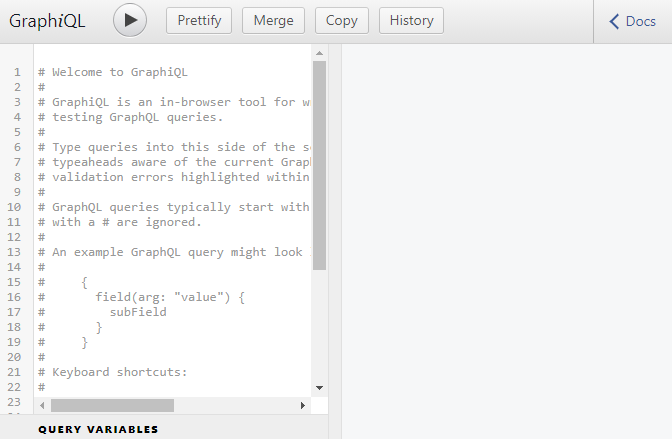
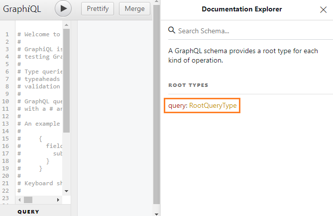
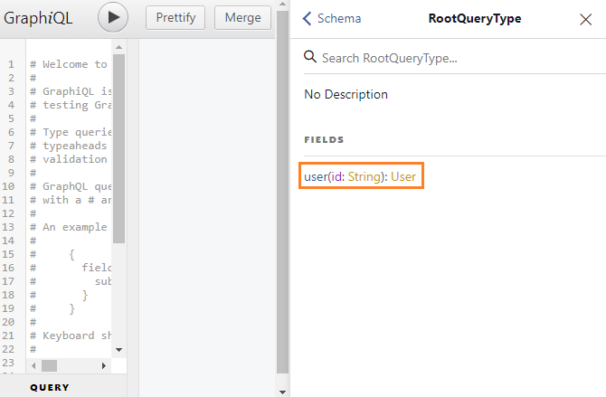
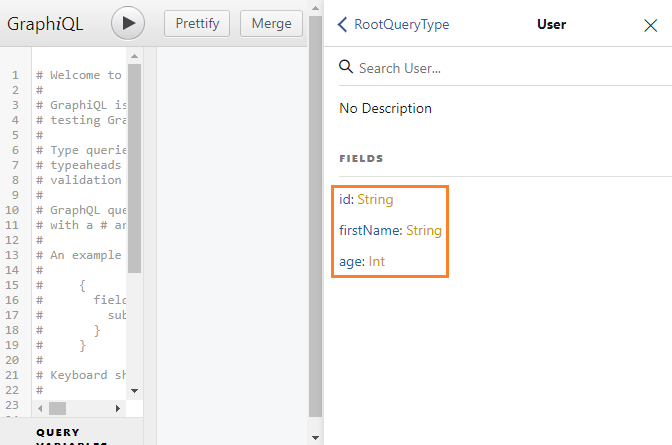
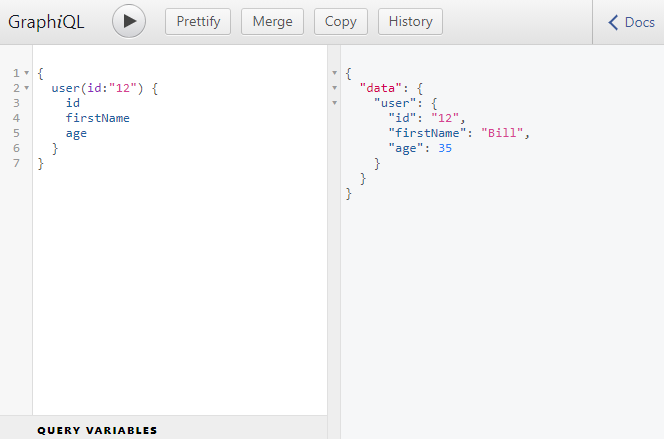
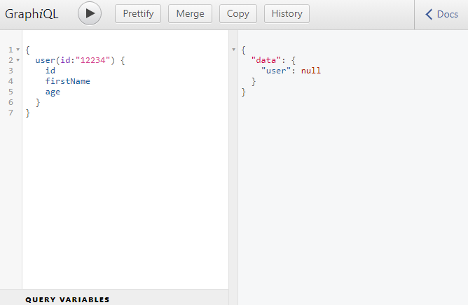

###### This blog post is part of a series. You must finish [part-1](https://hemanta.io/how-to-build-an-express-graphql-server-part-one/) & [part-2](https://hemanta.io/how-to-build-an-express-graphql-server-part-2/) before continuing here.

We can now access the GraphiQL IDE at the ~~/graphql~~ endpoint. This is how the GraphiQL IDE looks like:

GraphiQL is a browser-based editor to explore and test GraphQL requests.

If you click on ~~Docs~~ at the top right corner, we get access to the Documentation Explorer, which will automatically get populated as we add different types of data to our application.

We have a ~~RootQueryType~~. Click on ~~RootQueryType~~ and you should see something like below:

This means that we can fetch a user if we provide an ~~id~~ of type String.

Now if you click on User, you should see a response that will have three properties: ~~id~~, ~~firstName~~ & ~~age~~.

As you can see, you can get a lot of information just looking inside the Documentation Explorer without checking your schema.

## GraphQL query

Let's write our first GraphQL query.

A query describes the data you want to fetch. Note that the query looks like the shape of the JSON you want, but is **NOT REALLY JSON**.

Here, we asked GraphQL to find the user with an ~~id~~ of 12. And if the user was found, we asked for the ~~id~~, ~~firstName~~ and the ~~age~~ of the user. The response that we got back from the server looks nearly identical to the query we made. It's imporatnt to note that the response is available as the value of the ~~data~~ field.

So, how does the query get resolved?

The query that we wrote gets sent to the ~~RootQuery~~. The ~~RootQuery~~ then takes the query and enters into our graph of data. Because we have specified ~~user~~ as the field of the query, the ~~RootQuery~~ went and found the ~~user~~ key inside its ~~fields~~ object.

We have specified in the ~~args~~ key that a query must come with an ~~id~~ of type String. In our query, we have provide the ~~id~~ argument of type String. Then GraphQL goes and finds the user based on the logic we have written inside the ~~resolve()~~ function. The ~~resolve()~~ function returns an object. GraphQL selects the ~~id~~, ~~firstName~~ and ~~age~~ properties from the object and returns them as response.

If we try to query for a user that does not exist, we don't get an error. We get the value of the user as ~~null~~.

Go to [part-4](https://hemanta.io/how-to-build-an-express-graphql-server-part-4/)
