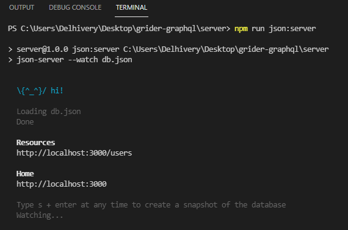
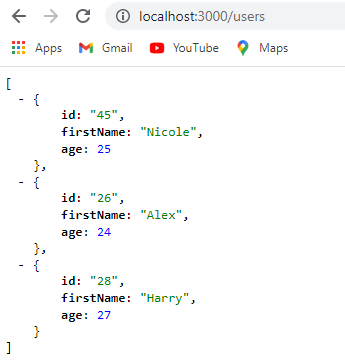
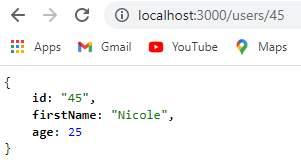
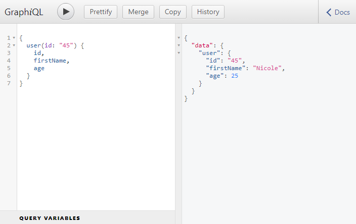

```toc

```

###### This blog post is part of a series. You must finish [part-1](https://hemanta.io/how-to-build-an-express-graphql-server-part-one/), [part-2](https://hemanta.io/how-to-build-an-express-graphql-server-part-2/) & [part-3](https://hemanta.io/how-to-build-an-express-graphql-server-part-3/) before continuing here.

## Fake REST API

In our ~~schema.js~~ file, we have hard-coded a list of users. However, in a real-world scenario, we will be fetching data from a database or a third-party API.

In this post, we are going simulate the real-world scenario by using ~~json-server~~, a fake REST API, to which our GraphQL server will make HTTP requests to fetch data.

Let's install ~~json-server~~.

```sh
PS C:\Users\Delhivery\Desktop\gql-app\server> npm i json-server
```

In the ~~server~~ directory, make a new file named ~~db.json~~ and paste the following list of users.

```json:title=server/db.json {numberLines}
{
    "users": [
      {
        "id": "45",
        "firstName": "Nicole",
        "age": 25,
      },
      {
        "id": "26",
        "firstName": "Alex",
        "age": 24,
      },
      {
        "id": "28",
        "firstName": "Harry",
        "age": 27,
      }
    ]
}
```

Make sure to use double quotes. Valid JSON requires double quotes.

In order to start our JSON server, we will add a helper script inside the ~~package.json~~ file.

```json:title=server/package.json {numberLines, 8}
{
  "name": "server",
  "version": "1.0.0",
  "description": "",
  "main": "index.js",
  "scripts": {
    "start": "nodemon index.js",
    "json:server": "json-server --watch db.json"
  },
  "keywords": [],
  "author": "",
  "license": "ISC",
  "dependencies": {
    "express": "^4.17.1",
    "express-graphql": "^0.12.0",
    "json-server": "^0.16.3",
    "lodash": "^4.17.21",
    "nodemon": "^2.0.7"
  }
}
```

Open a second terminal window and run the following command to start the JSON server.

```sh
PS C:\Users\Delhivery\Desktop\gql-app\server> npm run json:server
```

In the console, you should see an outout like this:



Our JSON server is running at ~~http://localhost:3000~~ and we can get access to our list of users (_which we have inside the ~~db.json~~ file_) at the ~~/users~~ endpoint. If you visit ~~http://localhost:3000/users~~ URL, you should see the list of users.



Note that ~~json-server~~ serves up raw JSON data.

It's imporatnt to note that the JSON server is a completely different running process than our GraphQL server.

The GraphiQL instance is running on port 5000 (~~http://localhost:5000/graphql~~), whereas the JSON server is running on port 3000 (~~http://localhost:3000~~).

If we go to ~~http://localhost:3000/users/45~~, we get a single user with an ~~id~~ of 45.



Now that our JSON server is running, we have to figure out a way to make a request from the GraphQL server to this fake REST API and fetch some data.

## Async resolve function

Previously inside the ~~resolve()~~ function inside ~~RootQuery~~, we synchronously fetched data which was hard-coded inside the ~~schema.json~~ file.

Now, with a fake REST API in place, GraphQL will make a network request to the JSON server to fetch user data. And making a network request is asynchronous in nature.

The ~~resolve()~~ function can also work in an asynchronous fashion.

If we return a Promise from the ~~resolve()~~ function, GraphQL will automatically detect that we have returned a Promise. It will then wait for the Promise to resolve, grab the data that the Promise resolved with and send the response back to the user.

So, when we will make a query from our GraphiQL interface, the query will go to GraphQL, which will then reach out to the JSON server by making a HTTP request. GraphQL will wait for the request to resolve and send the response it got from the JSON server back to the GraphiQL client.

We will use ~~axios~~ to make asynchronous HTTP requests inside the ~~resolve()~~ function

Let's install ~~axios~~.

```sh
PS C:\Users\Delhivery\Desktop\gql-app\server> npm i axios
```

In the ~~schema.js~~ file, we will remove the hard-coded list of users and the ~~lodash~~ import, because we will now make use of the JSON server.

Update the ~~schema.js~~ file as follows:

```js:title=server/schema.js {numberLines, 2-2, 22-24}
const graphql = require("graphql");
const axios = require("axios");

const { GraphQLString, GraphQLObjectType, GraphQLInt, GraphQLSchema } = graphql;

const UserType = new GraphQLObjectType({
  name: "User",
  fields: {
    id: { type: GraphQLString },
    firstName: { type: GraphQLString },
    age: { type: GraphQLInt },
  },
});

const RootQuery = new GraphQLObjectType({
  name: "RootQueryType",
  fields: {
    user: {
      type: UserType,
      args: { id: { type: GraphQLString } },
      resolve(parentValue, args) {
        return axios
          .get(`http://localhost:3000/users/${args.id}`)
          .then((res) => res.data);
      },
    },
  },
});

module.exports = new GraphQLSchema({
  query: RootQuery,
});
```

Note that when ~~axios~~ resolves, the actual response will be nested inside the ~~data~~ property.

Make sure both the servers are running. Then go to GraphiQL and make a query for the user with an ~~id~~ of 45. And we get the response from the JSON server. Perfect.



Go to [part-5](https://hemanta.io/how-to-build-an-express-graphql-server-part-5/)
