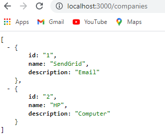
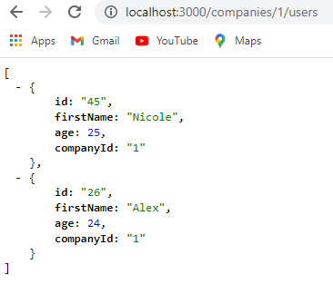
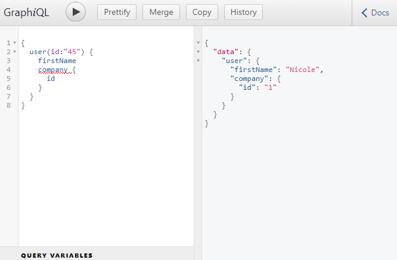
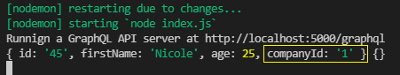
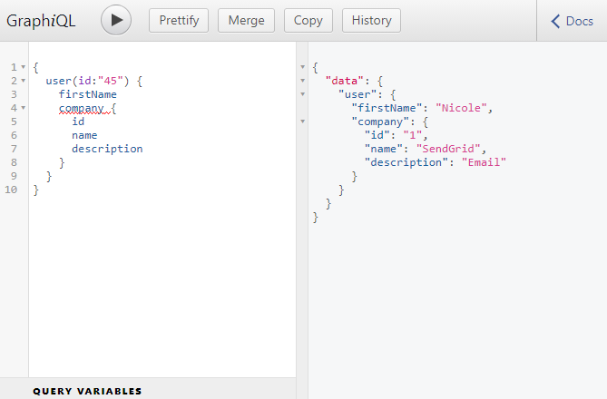

```toc

```

###### This blog post is part of a series. You must finish [part-1](https://hemanta.io/how-to-build-an-express-graphql-server-part-one/), [part-2](https://hemanta.io/how-to-build-an-express-graphql-server-part-2/), [part-3](https://hemanta.io/how-to-build-an-express-graphql-server-part-3/) & [part-4](https://hemanta.io/how-to-build-an-express-graphql-server-part-4/) before continuing here.

## Adding a list of companies

Our schema has an idea about the presence of a user. Next, we will introduce the idea of a company and relate it to a user.

Every company will have an ~~id~~, ~~name~~ and ~~description~~. And we will associate a company with a particular user by adding a ~~companyId~~ property to the user object.

First off, we will create a list of two companies in the ~~db.json~~ file and add a ~~companyId~~ property to the individual users. Then we will go to our ~~schema.js~~ file and define a ~~CompanyType~~.

```json:title=server/db.json {numberLines, 7-7, 13-13, 19-19, 22-33}
{
  "users": [
    {
      "id": "45",
      "firstName": "Nicole",
      "age": 25,
      "companyId": "1"
    },
    {
      "id": "26",
      "firstName": "Alex",
      "age": 24,
      "companyId": "1"
    },
    {
      "id": "28",
      "firstName": "Harry",
      "age": 27,
      "companyId": "2"
    },
  ],
  "companies": [
    {
      "id": "1",
      "name": "SendGrid",
      "description": "Email"
    },
    {
      "id": "2",
      "name": "HP",
      "description": "Computer"
    }
  ]
}
```

Now if we visit the JSON server at ~~http://localhost:3000/companies~~, we get the list of companies that we have defined inside the ~~db.json~~ file.



Because we have added the ~~companyId~~ property on each user, JSON server has behind the scenes mapped the relationship between the ~~users~~ and ~~companies~~. So, if we visit ~~http://localhost:3000/companies/1/users~~, we will get the list of users working at the company with an ~~id~~ of 1.



## Defining a CompanyType

Our JSON server now has an idea about both the users & the companies.

Next, we will define a ~~CompanyType~~ in the ~~schema.js~~ file.

**Make sure to define the ~~CompanyType~~ above the ~~UserType~~**. I will explain later why the order of the type definition is important.

We will define the ~~CompanyType~~ in exactly the same manner we defined the ~~UserType~~.

```js:title=server/schema.js {numberLines, 6-13}
const graphql = require("graphql");
const axios = require("axios");

const { GraphQLString, GraphQLObjectType, GraphQLInt, GraphQLSchema } = graphql;

const CompanyType = new GraphQLObjectType({
  name: "Company",
  fields: {
    id: { type: GraphQLString },
    name: { type: GraphQLString },
    description: { type: GraphQLString },
  },
});

const UserType = new GraphQLObjectType({
  name: "User",
  fields: {
    id: { type: GraphQLString },
    firstName: { type: GraphQLString },
    age: { type: GraphQLInt },
  },
});

const RootQuery = new GraphQLObjectType({
  name: "RootQueryType",
  fields: {
    user: {
      type: UserType,
      args: { id: { type: GraphQLString } },
      resolve(parentValue, args) {
        return axios
          .get(`http://localhost:3000/users/${args.id}`)
          .then((res) => res.data);
      },
    },
  },
});

module.exports = new GraphQLSchema({
  query: RootQuery,
});
```

Now that we have defined the ~~CompanyType~~, we need to associate it with a user. We can do so by adding a ~~company~~ property inside the ~~fields~~ property of the ~~UserType~~ object.

Next, we will define a ~~resolve()~~ function so that GraphQL can find out the company associated with a given user.

Add the highlighted code snippets in the ~~schema.js~~ file.

```js:title=server/schema.js {numberLines, 21-28}
const graphql = require("graphql");
const axios = require("axios");

const { GraphQLString, GraphQLObjectType, GraphQLInt, GraphQLSchema } = graphql;

const CompanyType = new GraphQLObjectType({
  name: "Company",
  fields: {
    id: { type: GraphQLString },
    name: { type: GraphQLString },
    description: { type: GraphQLString },
  },
});

const UserType = new GraphQLObjectType({
  name: "User",
  fields: () => ({
    id: { type: GraphQLString },
    firstName: { type: GraphQLString },
    age: { type: GraphQLInt },
    company: {
      type: CompanyType,
      resolve(parentValue, args) {
        return axios
          .get(`http://localhost:3000/companies/${parentValue.companyId}`)
          .then((res) => res.data);
      },
    },
  }),
});

const RootQuery = new GraphQLObjectType({
  name: "RootQueryType",
  fields: {
    user: {
      type: UserType,
      args: { id: { type: GraphQLString } },
      resolve(parentValue, args) {
        return axios
          .get(`http://localhost:3000/users/${args.id}`)
          .then((res) => res.data);
      },
    },
  },
});

module.exports = new GraphQLSchema({
  query: RootQuery,
});
```

This is the first time, we have made use of the ~~parentValue~~ argument on line 25. The ~~companyId~~ is available inside the ~~parentValue~~ argument. We can prove this by logging the value of ~~parentValue~~ in the console.

Make sure you have both the JSON server and the GraphiQL instance running. Add a console.log statement (~~console.log(parentValue, args)~~) inside the ~~resolve()~~ function of the ~~UserType~~ object.

Go to GraphiQL and make a query as shown below.



We are making a query so that the ~~resolve()~~ function inside the ~~UserType~~ object gets triggered and we can log the values of ~~parentValue~~ and ~~args~~ in the console.

Execute the query and now, you should see the following output in the console. As we can see, the ~~companyId~~ is available inside ~~parentValue~~.



If we ask ask for the values of ~~name~~ and ~~description~~ of the company in our query, we get the apprpriate response as well.



Now, let's understand the process that GraphQL went through to fetch the user(~~id~~:45) and the company associated with the user.

When we made the query, it went to ~~RootQuery~~ with an ~~args~~ object with an ~~id~~ property of 45. The ~~RootQuery~~ then pointed GraphQL to the user with an ~~id~~ of 45, thanks to the ~~resolve()~~ function.

We also wanted to know about the company associated with that user. This time the user’s ~~resolve()~~ function got called, with the first argument of ~~parentValue~~ and an empty ~~args~~ object. (_The ~~parentValue~~ is the node on the graph the query is coming from, which is user 45 in our case._) The ~~args~~ object didn't get passed along the chain and the ~~resolve()~~ function of the ~~UserType~~ object returned a Promise that eventually returned to us the company we were looking for.

So, a better way to thing about schema is to think of them as a bunch of functions that return references to other objects in our graph and we can think of the edges in the graph as ~~resolve()~~ functions.

Go to [part-6](https://hemanta.io/how-to-build-an-express-graphql-server-part-6/)
