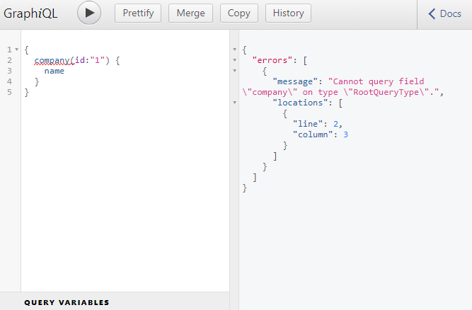
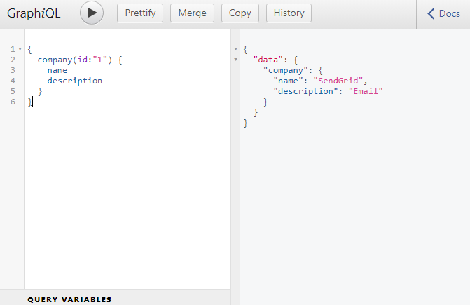
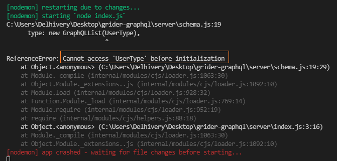
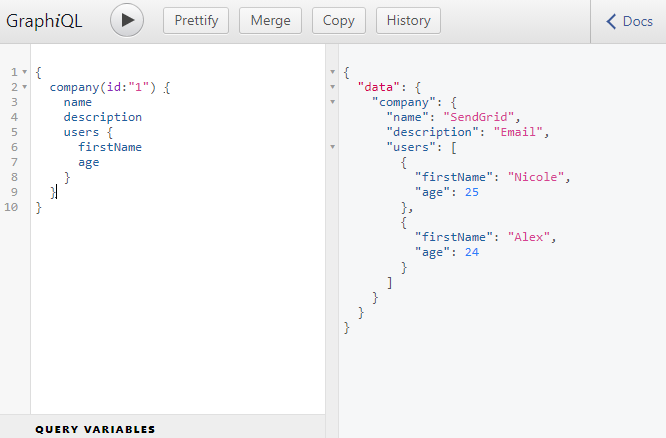

```toc

```

###### This blog post is part of a series. You must finish [part-1](https://hemanta.io/how-to-build-an-express-graphql-server-part-one/), [part-2](https://hemanta.io/how-to-build-an-express-graphql-server-part-2/), [part-3](https://hemanta.io/how-to-build-an-express-graphql-server-part-3/), [part-4](https://hemanta.io/how-to-build-an-express-graphql-server-part-4/) & [part-5](https://hemanta.io/how-to-build-an-express-graphql-server-part-5/) before continuing here.

## Multiple RootQuery end points

Right now, our data graph is unidirectional in nature. It only allows us to query for a user. We don’t yet have the capability to directly query for a company. We can only access a company by first accessing a user and then the associated company.

In GraphiQL, if we issue a query asking for the name of a company with an ~~id~~ of 1, we get an error that says, we don’t have a company field in our ~~RootQueryType~~.



Inside the ~~schema.js~~ file, inside the ~~fields~~ property of ~~RootQuery~~, we will add a ~~company~~ property as a sibling to the ~~user~~ property.

```js:title=server/schema.js {numberLines, 44-52}
const graphql = require("graphql");
const axios = require("axios");

const { GraphQLString, GraphQLObjectType, GraphQLInt, GraphQLSchema } = graphql;

const CompanyType = new GraphQLObjectType({
  name: "Company",
  fields: {
    id: { type: GraphQLString },
    name: { type: GraphQLString },
    description: { type: GraphQLString },
  },
});

const UserType = new GraphQLObjectType({
  name: "User",
  fields: () => ({
    id: { type: GraphQLString },
    firstName: { type: GraphQLString },
    age: { type: GraphQLInt },
    company: {
      type: CompanyType,
      resolve(parentValue, args) {
        return axios
          .get(`http://localhost:3000/companies/${parentValue.companyId}`)
          .then((res) => res.data);
      },
    },
  }),
});

const RootQuery = new GraphQLObjectType({
  name: "RootQueryType",
  fields: {
    user: {
      type: UserType,
      args: { id: { type: GraphQLString } },
      resolve(parentValue, args) {
        return axios
          .get(`http://localhost:3000/users/${args.id}`)
          .then((res) => res.data);
      },
    },
    company: {
      type: CompanyType,
      args: { id: { type: GraphQLString } },
      resolve(parentValue, args) {
        return axios
          .get(`http://localhost:3000/companies/${args.id}`)
          .then((res) => res.data);
      },
    },
  },
});

module.exports = new GraphQLSchema({
  query: RootQuery,
});

```

The ~~args~~ property on line 46 says that whenever anyone makes a query for a company, they must provide an ~~id~~ argument of type String.

Now, if we go to GraphiQL and ask for the details of a company with an ~~id~~ of 1, we will get our response.



## Bidirectional items

Currently our GraphQL API has the following capabilities.

- We can directly ask for a user or a list of users.
- We can directly ask for a user and the company associated with the user.
- We can also directly ask for a company.

We dont yet have the capability to go from a company over to a user. This is because we have not defined a ~~users~~ field inside the ~~CompanyType~~ object inside our ~~schema.js~~ file.

Add a ~~users~~ field inside the ~~CompanyType~~ object as highlighted below. Also remember to import ~~GraphQLList~~ from ~~graphql~~.

```js:title=server/schema.js {numberLines, 4-4, 12-19}
const graphql = require("graphql");
const axios = require("axios");

const { GraphQLString, GraphQLObjectType, GraphQLInt, GraphQLSchema, GraphQLList } = graphql;

const CompanyType = new GraphQLObjectType({
  name: "Company",
  fields: {
    id: { type: GraphQLString },
    name: { type: GraphQLString },
    description: { type: GraphQLString },
    users: {
      type: new GraphQLList(UserType),
      resolve(parentValue, args) {
        return axios
          .get(`http://localhost:3000/companies/${parentValue.id}/users`)
          .then((response) => response.data);
      },
    },
  },
});

const UserType = new GraphQLObjectType({
  name: "User",
  fields: {
    id: { type: GraphQLString },
    firstName: { type: GraphQLString },
    age: { type: GraphQLInt },
    company: {
      type: CompanyType,
      resolve(parentValue, args) {
        return axios
          .get(`http://localhost:3000/companies/${parentValue.companyId}`)
          .then((res) => res.data);
      },
    },
  },
});

const RootQuery = new GraphQLObjectType({
  name: "RootQueryType",
  fields: {
    user: {
      type: UserType,
      args: { id: { type: GraphQLString } },
      resolve(parentValue, args) {
        return axios
          .get(`http://localhost:3000/users/${args.id}`)
          .then((res) => res.data);
      },
    },
    company: {
      type: CompanyType,
      args: { id: { type: GraphQLString } },
      resolve(parentValue, args) {
        return axios
          .get(`http://localhost:3000/companies/${args.id}`)
          .then((res) => res.data);
      },
    },
  },
});

module.exports = new GraphQLSchema({
  query: RootQuery,
});
```

Note that a company is associated with multiple users. This is why, on line 13, we have wrapped ~~UserType~~ with ~~GraphQLList~~.

Once we add the above-mentioned block of code, we are going to receive an error in our console.



## Resolving circular reference

We can figure out the problem from the error message we received in the console.

The problem is: we have defined the ~~UserType~~ after we have defined the ~~CompanyType~~ inside the ~~schema.js~~ file. However, JavaScript doesn't allow us to access a variable before we have defined the variable. Yet, we are trying to access the ~~UserType~~ inside the ~~CompanyType~~ on line 13.

You might think we can solve the problem by defining ~~UserType~~ before ~~CompanyType~~. But then we will face another problem. In ~~UserType~~, we are also referencing ~~CompanyType~~.

We have a circular reference in our application. The ~~UserType~~ needs access to the ~~CompanyType~~ and the ~~CompanyType~~ needs access to the ~~UserType~~.

So, how do we resolve the problem of circular references?

We can solve the issue by wrapping the value of the ~~fields~~ property in both the ~~CompanyType~~ and the ~~UserType~~ with an arrow function.

Modify the ~~schema.js~~ file as shown below:

```js:title=server/schema.js {numberLines, 14-26, 31-43}
const graphql = require("graphql");
const axios = require("axios");

const {
  GraphQLString,
  GraphQLObjectType,
  GraphQLInt,
  GraphQLSchema,
  GraphQLList,
} = graphql;

const CompanyType = new GraphQLObjectType({
  name: "Company",
  fields: () => ({
    id: { type: GraphQLString },
    name: { type: GraphQLString },
    description: { type: GraphQLString },
    users: {
      type: new GraphQLList(UserType),
      resolve(parentValue, args) {
        return axios
          .get(`http://localhost:3000/companies/${parentValue.id}/users`)
          .then((response) => response.data);
      },
    },
  }),
});

const UserType = new GraphQLObjectType({
  name: "User",
  fields: () => ({
    id: { type: GraphQLString },
    firstName: { type: GraphQLString },
    age: { type: GraphQLInt },
    company: {
      type: CompanyType,
      resolve(parentValue, args) {
        return axios
          .get(`http://localhost:3000/companies/${parentValue.companyId}`)
          .then((res) => res.data);
      },
    },
  }),
});

const RootQuery = new GraphQLObjectType({
  name: "RootQueryType",
  fields: {
    user: {
      type: UserType,
      args: { id: { type: GraphQLString } },
      resolve(parentValue, args) {
        return axios
          .get(`http://localhost:3000/users/${args.id}`)
          .then((res) => res.data);
      },
    },
    company: {
      type: CompanyType,
      args: { id: { type: GraphQLString } },
      resolve(parentValue, args) {
        return axios
          .get(`http://localhost:3000/companies/${args.id}`)
          .then((res) => res.data);
      },
    },
  },
});

module.exports = new GraphQLSchema({
  query: RootQuery,
});

```

We don't have the error message in the console anymore.

Now our GraphQL API has such capabilities that we can directly query for a company and the list of users associated with the company.

Let’s move over to GraphiQL and run the following query. As you can see, we are now able to fetch the details of a company along with the details of the lists of users associated with that company.



Go to [part-7](https://hemanta.io/how-to-build-an-express-graphql-server-part-7/)
