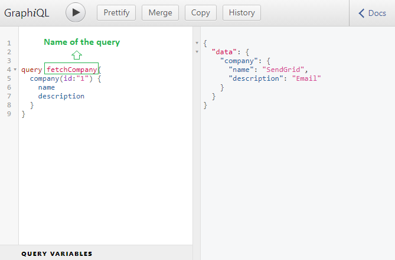
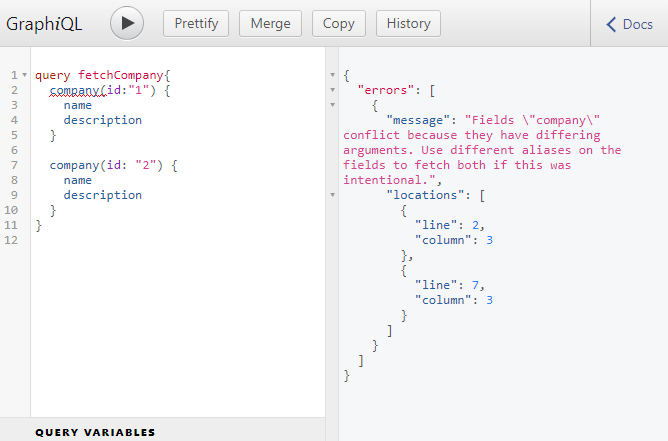
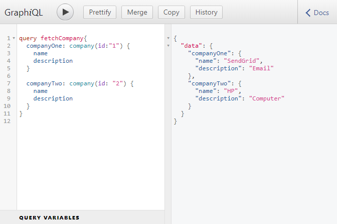
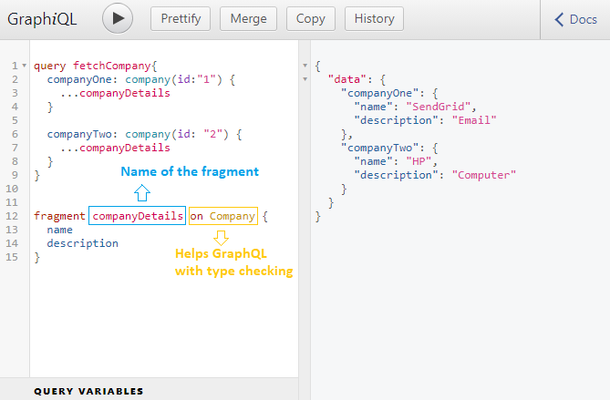

```toc

```

###### This blog post is part of a series. You must finish [part-1](https://hemanta.io/how-to-build-an-express-graphql-server-part-one/), [part-2](https://hemanta.io/how-to-build-an-express-graphql-server-part-2/), [part-3](https://hemanta.io/how-to-build-an-express-graphql-server-part-3/), [part-4](https://hemanta.io/how-to-build-an-express-graphql-server-part-4/), [part-5](https://hemanta.io/how-to-build-an-express-graphql-server-part-5/) & [part-6](https://hemanta.io/how-to-build-an-express-graphql-server-part-6/) before continuing here.

Until now, we have been writing queries inside the GraphiQL IDE like the following.

```sh
{
  company (id: "1") {
    name
    description
  }
}
```

Now if I we add the text ~~query~~, the response is not going to change.

```sh
query {
  company (id: "1") {
    name
    description
  }
}
```

We can also name our query as follows:



Naming queries become useful when we make multiple different queries from the frontend of our application.

## Named query results with aliases

With GraphQL, we can send multiple queries in a single request. However, since the response data is shaped after the structure of the fields being requested, we will run into naming issues when sending multiple queries asking for the same fields.



We get an error, simply because, in the response, which is a javaScript object, we can’t have duplicate keys. So, we will have to rename the results of the fields to anything we want.



You will notice that in both our queries we are asking for the ~~name~~ and ~~description~~ of the company. We are asking for the details twice. Typing just two properties is not a big problem but if we were querying for ten properties lets say, then typing those ten properties in two places would get tiresome. To solve this issue, we can make use of query fragments.

## Query fragment

A query fragment is essentially a list of properties that we want to get access to.

So, let’s define a query fragment.

```sh
fragment companyDetails on Company {
  name
  description
}
```

Now, instead of listing out individual property names in both the locations inside our query, we can use the fragment we just defined.

Let’s go back to GraphiQL and use the query fragment.



Go to [part-8](https://hemanta.io/how-to-build-an-express-graphql-server-part-8/)
