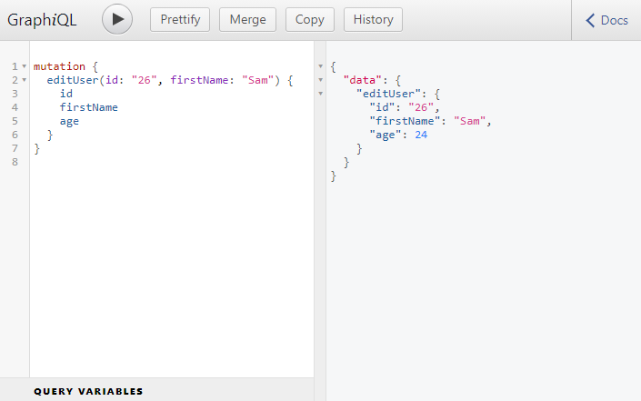

```toc

```

###### This blog post is part of a series. You must finish [part-1](https://hemanta.io/how-to-build-an-express-graphql-server-part-one/), [part-2](https://hemanta.io/how-to-build-an-express-graphql-server-part-2/), [part-3](https://hemanta.io/how-to-build-an-express-graphql-server-part-3/), [part-4](https://hemanta.io/how-to-build-an-express-graphql-server-part-4/), [part-5](https://hemanta.io/how-to-build-an-express-graphql-server-part-5/), [part-6](https://hemanta.io/how-to-build-an-express-graphql-server-part-6/) & [part-7](https://hemanta.io/how-to-build-an-express-graphql-server-part-7/) before continuing here.

## GraphQL mutations

Until now, we have explored writing queries and getting data from the server.

In this section, we are going to learn how to modify the data stored in our JSON server by using mutations.

We use mutations to create, delete or update records in our database.

## addUser()

First, in our ~~schema.js~~ file, we are going to define a root mutation right above ~~module.exports~~.

The first mutation that we are going to work with will be to add a user to our collection of users. We will name it ~~addUser~~. You should name the mutation in such a way that it indicates the purpose of the mutation.

Add the highlighted code in the ~~schema.js~~ file.

```js:title=server/schema.js {numberLines, 10-10, 71-90, 94-94 }
const graphql = require("graphql");
const axios = require("axios");

const {
  GraphQLString,
  GraphQLObjectType,
  GraphQLInt,
  GraphQLSchema,
  GraphQLList,
  GraphQLNonNull
} = graphql;

const CompanyType = new GraphQLObjectType({
  name: "Company",
  fields: () => ({
    id: { type: GraphQLString },
    name: { type: GraphQLString },
    description: { type: GraphQLString },
    users: {
      type: new GraphQLList(UserType),
      resolve(parentValue, args) {
        return axios
          .get(`http://localhost:3000/companies/${parentValue.id}/users`)
          .then((response) => response.data);
      },
    },
  }),
});

const UserType = new GraphQLObjectType({
  name: "User",
  fields: () => ({
    id: { type: GraphQLString },
    firstName: { type: GraphQLString },
    age: { type: GraphQLInt },
    company: {
      type: CompanyType,
      resolve(parentValue, args) {
        return axios
          .get(`http://localhost:3000/companies/${parentValue.companyId}`)
          .then((res) => res.data);
      },
    },
  }),
});

const RootQuery = new GraphQLObjectType({
  name: "RootQueryType",
  fields: {
    user: {
      type: UserType,
      args: { id: { type: GraphQLString } },
      resolve(parentValue, args) {
        return axios
          .get(`http://localhost:3000/users/${args.id}`)
          .then((res) => res.data);
      },
    },
    company: {
      type: CompanyType,
      args: { id: { type: GraphQLString } },
      resolve(parentValue, args) {
        return axios
          .get(`http://localhost:3000/companies/${args.id}`)
          .then((res) => res.data);
      },
    },
  },
});

const mutation = new GraphQLObjectType({
  name: "Mutation",
  fields: {
    addUser: {
      type: UserType,
      args: {
        // 'firstName' must be provided in the query
        firstName: { type: new GraphQLNonNull(GraphQLString) },
        // 'age' must be provided in the query
        age: { type: new GraphQLNonNull(GraphQLInt) },
        companyId: { type: GraphQLString },
      },
      resolve(parentValue, { firstName, age }) {
        return axios
          .post(`http://localhost:3000/users`, { firstName, age })
          .then((res) => res.data);
      },
    },
  },
});

module.exports = new GraphQLSchema({
  query: RootQuery,
  mutation,
});
```

**LINE 75**: The ~~type~~ field represents the type of the data that we are eventually going to return from the ~~resolve()~~ function, which is ~~UserType~~.

**LINE 76**: The ~~args~~ field represents the arguments that we are going to pass to the ~~resolve()~~ function.

**LINE 78 & 80**: We have added validation to the ~~firstName~~ and ~~age~~ properties by using the ~~GraphQLNonNull~~ helper, using which, we are essentially saying that if someone calls the ~~addUser()~~ mutation,, they must provide the ~~firstName~~ and ~~age~~ properties. Otherwise, an error will be thrown.

**LINE 83-87**: Inside the ~~resolve()~~ function, we have made a ~~POST~~ request to our JSON server.

**LINE 94**: We have associated the mutation with the GraphQL schema.

Now, if you open up the Documentation Explorer panel in the GraphQL IDE, you should see the mutation type.


And if you click on mutation, you should see the ~~addUser()~~ mutation. The exclamation marks after the String denote that the property is required.


Now, let's add a user to our list of users.

If we try to add a user without the ~~age~~ property, we will get an error, because, we have defined the ~~age~~ property to be required in the ~~addUser()~~ mutation by using the ~~GraphQLNonNull~~ helper.


Now, add the ~~age~~ property, execute the mutation and we have now added a new user to the list of users.


If we go to ~~http://localhost:3000/users~~, we see the new user in the list.


## deleteUser()

Now, we have the ability to add a user. Next, we will create a ~~deleteUser()~~ mutation that will allow us to delete a user from the list of users.

Update the ~~schema.js~~ file as follows:

```js:title=server/schema.js {numberLines, 22-32}

// Rest of the code

const mutation = new GraphQLObjectType({
  name: "Mutation",
  fields: {
    addUser: {
      type: UserType,
      args: {
        // 'firstName' must be provided in the query
        firstName: { type: new GraphQLNonNull(GraphQLString) },
        // 'age' must be provided in the query
        age: { type: new GraphQLNonNull(GraphQLInt) },
        companyId: { type: GraphQLString },
      },
      resolve(parentValue, { firstName, age }) {
        return axios
          .post(`http://localhost:3000/users`, { firstName, age })
          .then((res) => res.data);
      },
    },
    deleteUser: {
      type: UserType,
      args: {
        id: { type: new GraphQLNonNull(GraphQLString) },
      },
      resolve(parentValue, { id }) {
        return axios
          .delete(`http://localhost:3000/users/${id}`)
          .then((res) => res.data);
      },
    },
  },
});

module.exports = new GraphQLSchema({
  query: RootQuery,
  mutation,
});
```

In the ~~deleteUser()~~ mutation, we are saying that if you want to delete a user, you must provide the ~~id~~ of the user. And inside the ~~resolve()~~ function, we make a HTTP ~~DELETE~~ request to the JSON server.

Let's try to delete a user from the GraphiQL IDE using the ~~deleteUser()~~ mutation.


We have successfull deleted the user with an ~~id~~ 45. We can check that by going to ~~http://localhost:3000/users~~.


As you can see we don't have the user with an ~~id~~ of 45 in the list.

But then why GraphQL returned the value of the ~~id~~, ~~firstName~~ and ~~age~~ properties of the user that it deleted from the server as null?

This is simpley because JSON server does not respond with any details of the record that it deletes. This is how the JSON server behaves by default.

## editUser()

We will work on this last mutation called ~~editUser()~~ that will allow us to edit the details of a user.

```js:title=server/schema.js {numberLines, 33-46}

// Rest of the code

const mutation = new GraphQLObjectType({
  name: "Mutation",
  fields: {
    addUser: {
      type: UserType,
      args: {
        // 'firstName' must be provided in the query
        firstName: { type: new GraphQLNonNull(GraphQLString) },
        // 'age' must be provided in the query
        age: { type: new GraphQLNonNull(GraphQLInt) },
        companyId: { type: GraphQLString },
      },
      resolve(parentValue, { firstName, age }) {
        return axios
          .post(`http://localhost:3000/users`, { firstName, age })
          .then((res) => res.data);
      },
    },
    deleteUser: {
      type: UserType,
      args: {
        id: { type: new GraphQLNonNull(GraphQLString) },
      },
      resolve(parentValue, { id }) {
        return axios
          .delete(`http://localhost:3000/users/${id}`)
          .then((response) => response.data);
      },
    },
    editUser: {
      type: UserType,
      args: {
        id: { type: new GraphQLNonNull(GraphQLString) },
        firstName: { type: GraphQLString },
        age: { type: GraphQLInt },
        companyId: { type: GraphQLString },
      },
      resolve(parentValue, args) {
        return axios
          .patch(`http://localhost:3000/users/${args.id}`, args)
          .then((res) => res.data);
      },
    },
  },
});

module.exports = new GraphQLSchema({
  query: RootQuery,
  mutation,
});
```

On line 43, note that we are making a ~~PATCH~~ request, not a ~~PUT~~ request.

> **NOTE:** A ~~PUT~~ request is used when we want to completely replace the existing record saved in our database. A ~~PATCH~~ request on the other hand only overwrites the properties contained within the request body.

Let's change the ~~firstName~~ of the user with an ~~id~~ of 26 from ~~Alex~~ to ~~Sam~~.



Our ~~editUser()~~ mutation was executed successfully. Try changing other properties of the user, and you should be able to edit the details without any problem.

## Conclusion

This blog post marks the end of the series on how to build an Express/GraphQL server. Hope you folks learned something. I am planning another series on how to work with GraphQL from the front-end of the application. Also, I might create a series where we build a full-stack React+GraphQL application from scratch.
