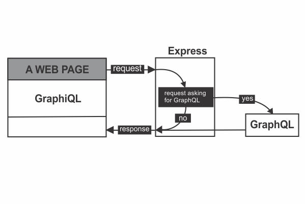
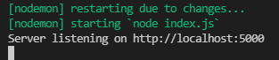
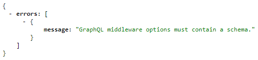

```toc

```

## Application architecture

The overall architecture of the application that we are going to build in this blog series is as follows:



We will use ~~GraphiQL~~, a browser-based editor to explore and test GraphQL requests. We will use Express to create a web server to listen for incoming HTTP requests.

Express will run a check on every request sent by the client and figure out whether the request is asking for GraphQL. If yes, Express will then hand over the request to GraphQL, which will do its processing (_communicate with a database or a third-party API for example_), put together a response and return the response back to Express, which in turn will forward the response back to the client.

If the request is not asking for GraphQL, then Express will do the necessary processing and send back the response to the client.

It's important to note that GraphQL is a small part of our Express application; its not the entire application.

Let's start building our application.

Create a folder on the desktop named ~~gql-app~~. Open the folder in VS Code or any other code editor of your choice.

Inside ~~gql-app~~, create a directory called ~~server~~, and inside the ~~server~~ directory create a file named ~~index.js~~.

Then initialize the ~~server~~ directory with ~~npm init y~~.

```sh
PS C:\Users\Delhivery\Desktop\gql-app\server> npm init -y
```

Then install the following 5 packages.

```sh
PS C:\Users\Delhivery\Desktop\gql-app\server> npm i express graphql express-graphql lodash nodemon
```

- ~~**express-graphql**~~: This module provides a simple way to create an Express server that runs a GraphQL API. By default, Express and GraphQL are not compatible. The ~~express-graphql~~ package will act as a glue layer between Express and GraphQL, so that they can work with each other.

- ~~**express**~~: We will use Express to create a web server, which will listen for incoming HTTP requests.

- ~~**graphql**~~: The GraphQL library used to crawl through our data.

- ~~**lodash**~~: A JavaScript library that contains utility functions.

- ~~**nodemon**~~: It will automatically restart our Express application when file changes are detected in the directory.

Then inside the scripts section of the ~~package.json~~ file, add the following highlighted line in order for ~~nodemon~~ to take effect.

```json:title=server/package.json {numberLines, 7}
{
  "name": "server",
  "version": "1.0.0",
  "description": "",
  "main": "index.js",
  "scripts": {
    "start":"nodemon index.js"
  },
  "keywords": [],
  "author": "",
  "license": "ISC",
  "dependencies": {
    "express": "^4.17.1",
    "express-graphql": "^0.12.0",
    "lodash": "^4.17.21",
    "nodemon": "^2.0.7"
  }
}
```

## Creating an Express web server

Inside the ~~index.js~~ file, paste the following code.

```js:title=server/index.js {numberLines}
const express = require("express");

const app = express();

const PORT = 5000;

app.listen(PORT, () => {
  console.log(`Server listening on http://localhost:${PORT}`);
});
```

Start the server using the following command:

```sh
PS C:\Users\Delhivery\Desktop\gql-app\server> npm start
```

You should see the following output in the console.



Now our server is succcessfully listening on port 5000.

## Registering GraphQL with Express

Update the ~~index.js~~ file with the highlighted code snippets.

```js:title=server/index.js {numberLines, 2-2, 6-11}
const express = require("express");
const expressGraphQL = require("express-graphql").graphqlHTTP;

const app = express();

app.use(
  "/graphql",
  expressGraphQL({
    graphiql: true,
  })
);

const PORT = 5000;

app.listen(PORT, () => {
  console.log(`Server listening on http://localhost:${PORT}`);
});

```

On line 2, we have required in the ~~express-graphql~~ library.

We use ~~app.use()~~ to add middleware libraries into the request handling chain.

On line 6, we have mounted a GraphQL API server on the ~~/graphql~~ HTTP endpoint using the ~~express-graphql~~ library. This tell Express that requests coming to the ~~/graphql~~ endpoint will be handled by the ~~express-graphql~~ library. We provide a configuration object to the ~~expressGraphQL~~ function and add the ~~graphiql~~ property with a value of ~~true~~.

Now, if we navigate to ~~http://localhost:5000/graphql~~, we get an error message that says GraphQL middleware options must contain a schema.



In part-2, we will work on building our GraphQL schema and add it to the ~~expressGraphQL~~ middleware in order to get rid of the error message.

Go to [part-2](https://hemanta.io/how-to-build-an-express-graphql-server-part-2/)
