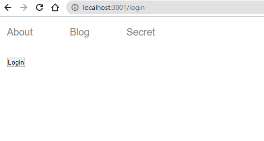

In this post, we will learn how to create protected routes in React Router v6.

Our example application looks like the following:


```js:title=src/components/Header.js {numberLines}
import React, { useContext } from "react"
import { NavLink, useNavigate } from "react-router-dom"
import { AuthContext } from "./UserInfo"

const Header = () => {
  const { name, setName } = useContext(AuthContext)

  const navigate = useNavigate()

  const handleLogout = () => {
    setName(null)
    navigate("/")
  }

  return (
    <>
      {name ? <button onClick={handleLogout}>Logout</button> : ""}
      <nav>
        <ul>
          <NavLink to="/about">
            <li>About</li>
          </NavLink>
          <NavLink to="/blog">
            <li>Blog</li>
          </NavLink>
          <NavLink to="/secret">
            <li>Secret</li>
          </NavLink>
        </ul>
      </nav>
    </>
  )
}

export default Header
```

```js:title=src/App.js {numberLines}
import React from "react"
import { Routes, Route } from "react-router-dom"
import Header from "./components/Header"
import Home from "./components/Home"
import About from "./components/About"
import Blog from "./components/Blog"
import Secret from "./components/Secret"

const App = () => {
  return (
    <>
      <header>
        <Header />
      </header>
      <main>
        <Routes>
          <Route path="/" element={<Home />} />
          <Route path="/about" element={<About />} />
          <Route path="/blog" element={<Blog />} />
          <Route path="/secret" element={<Secret />}></Route>
        </Routes>
      </main>
    </>
  )
}

export default App
```

Let’s say we want to protect the ~~/secret~~ route.


We want the ~~Secret~~ page to be accessible only to authenticated users.

To do so, the first step we need to do is to create a ~~\<PrivateRoute />~~ component.

```js:title=src/components/PrivateRoute.js {numberLines}
import React, { useContext } from "react"
import { Navigate, Outlet, useLocation } from "react-router-dom"
import { AuthContext } from "./UserInfo"

const PrivateRoute = () => {
  const { name } = useContext(AuthContext)

  const location = useLocation()

  return name ? <Outlet /> : <Navigate to="/login" state={{ from: location }} />
}

export default PrivateRoute
```

The role of the ~~PrivateRoute~~ component is to check the authenticated status of the user and direct the user to either the ~~Secret~~ page (_if the user is authenticated_) or the ~~Login~~ page (_if the user is not authenticated_).

We are using React Context API to store the authentication status of the user and share that status across many components. Below, on line 6, notice that we have passed ~~null~~ to ~~useState~~, which means that the user is not authenticated by default.

###### Learn more about React Context API in my blog post [here](https://hemanta.io/introduction-to-react-context-api/).

```js:title=src/components/UserInfo.js {numberLines, 6-6}
import React, { useState, createContext } from "react"

export const AuthContext = createContext()

const UserInfo = ({ children }) => {
  const [name, setName] = useState(null)

  const user = {
    name,
    setName,
  }

  return <AuthContext.Provider value={user}>{children}</AuthContext.Provider>
}

export default UserInfo
```

We wrap the ~~App~~ component with the ~~UserInfo~~ component, so that the ~~value~~ prop of the ~~AuthContext.Provider~~ component becomes available to all of ~~App~~’s descendant components.

```js:title=src/index.js {numberLines, 12-12, 14-14}
import React from "react"
import ReactDOM from "react-dom/client"
import "./index.css"
import App from "./App"
import { BrowserRouter as Router } from "react-router-dom"
import UserInfo from "./components/UserInfo"

const root = ReactDOM.createRoot(document.getElementById("root"))
root.render(
  <React.StrictMode>
    <Router>
      <UserInfo>
        <App />
      </UserInfo>
    </Router>
  </React.StrictMode>
)
```

After we create the ~~PrivateRoute~~ component, we wrap the ~~secret~~ route with the ~~secret~~ route, (the parent ~~secret~~ route) that renders the ~~PrivateRoute~~ component.

```js:title=src/App.js {numberLines, 23-23, 25-25}
import React from "react"
import { Routes, Route } from "react-router-dom"
import About from "./components/About"
import Blog from "./components/Blog"
import Header from "./components/Header"
import PrivateRoute from "./components/PrivateRoute"
import Secret from "./components/Secret"
import Login from "./components/Login"
import Home from "./components/Home"

const App = () => {
  return (
    <>
      <header>
        <Header />
      </header>
      <main>
        <Routes>
          <Route path="/" element={<Home />} />
          <Route path="/about" element={<About />} />
          <Route path="/blog" element={<Blog />} />
          <Route path="/login" element={<Login />} />
          <Route path="/secret" element={<PrivateRoute />}>
            <Route path="/secret" element={<Secret />}></Route>
          </Route>
        </Routes>
      </main>
    </>
  )
}

export default App
```

We have not created the ~~Login~~ component yet. Let’s do that now.

```js:title=src/components/Login.js {numberLines, 12-12}
import React, { useContext } from "react"
import { AuthContext } from "./UserInfo"
import { useNavigate, useLocation } from "react-router-dom"

const Login = () => {
  const { name, setName } = useContext(AuthContext)

  const navigate = useNavigate()
  const location = useLocation()

  const handleLogin = () => {
    setName("Hemanta")
    navigate(location.state ? location.state.from.pathname : "/")
  }

  return !name && <button onClick={handleLogin}>Login</button>
}

export default Login
```

On line 12, notice that, upon login, we are hard-coding the value ("Hemanta") of the ~~name~~ variable. In a real-world application, however, you would most likely get this data (_the name of the user or any other user attribute that you are using to keep track of the authentication status_) from an API endpoint.

Now, if we click on the ~~Secret~~ link, we get directed to the ~~Login page~~. We have successfully protected the ~~/secret~~ route.



Click on ~~Login~~ and we have access to the ~~Secret~~ page.


Click on ~~Logout~~ and we get directed to the ~~Home~~ page.

This is how we protect routes in React Router v6.
